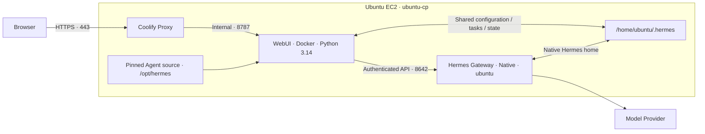

# Hermes Agent + WebUI Deployment Guide (EC2 & Coolify)

A unified, copy-pasteable guide for native Hermes on Ubuntu EC2, Docker-hosted Hermes WebUI in Coolify, and optional AI-agent automation.

---

## 🏗️ 1. Architecture & Security Model

### One Host, Two Runtimes



Browser chat uses the host Gateway. WebUI still needs local Agent imports for other features, so its image contains a separate, pinned Agent source tree. The host remains the scheduler and tool-execution runtime.

> [!CAUTION]
> **This is a trusted, single-operator deployment—not a sandbox.** WebUI receives read/write access to Hermes home, including credentials and state. With the local terminal backend, the host Agent can execute commands as `ubuntu`. Protect WebUI with a strong password and HTTPS; never publish Gateway port `8642` to the internet.

### Tested Compatibility Snapshot

| Component | Verified baseline · 2 October 2026 |
| :--- | :--- |
| Host OS | Ubuntu 24.04 LTS · x86_64 |
| Hermes Agent | `0.21.5+5637.gfd6a6fb` · commit `fd6a6fbf2eba1bee716a4b81f886a0a8cf40ea44` |
| Agent Python | `3.14.7` |
| WebUI | `0.52.401` · upstream experimental release |
| Coolify | `4.3.23` |
| Linux account | `ubuntu` · UID/GID `1000:1000` |

> [!NOTE]
> **The Dockerfile below is a locally tested compatibility repair, not an upstream release.** The original WebUI image used Python 3.12; the pinned Agent's dependencies require Python 3.14. A successful image pull or `/health` response alone did not prove Tasks and Skills worked. Keep these pins together until a replacement pair passes the same checks.

References: [Agent repository](https://github.com/NousResearch/hermes-agent), [WebUI repository](https://github.com/nesquena/hermes-webui), [WebUI source-boundary design](https://github.com/nesquena/hermes-webui/blob/master/docs/rfcs/agent-source-boundary.md).

---

## 📋 2. Setup Planning Worksheet

Replace every `<PLACEHOLDER>` before running a block. Bash blocks run **inside EC2 as `ubuntu`** unless labelled otherwise. PowerShell blocks run on Windows.

| Field | Value / example |
| :--- | :--- |
| SSH shortcut | `ubuntu-cp` |
| EC2 public address | `<EC2_PUBLIC_IP>` · preferably an Elastic IP |
| EC2 private address | `<EC2_PRIVATE_IP>` · current host: `172.31.0.195` |
| WebUI domain | `<WEBUI_DOMAIN>` · example: `hermes.karm8boost.online` |
| Coolify domain | `<COOLIFY_DOMAIN>` · a different hostname you control |
| Admin source address | `<ADMIN_PUBLIC_IP>/32` |
| Host Hermes home | `/home/ubuntu/.hermes` |
| Container Hermes home | `/home/hermeswebui/.hermes` |
| Application UUID | `<APP_UUID>` · copy from the Coolify application URL |

> [!WARNING]
> **Existing host? Skip fresh-install steps.** Do not reinstall Hermes, install another Coolify, replace `.env`, or create a second WebUI application just to follow this guide. Inspect what exists, back it up, then apply only the missing configuration. The repaired `ubuntu-cp` deployment already follows this architecture.

---

## ☁️ 3. EC2 Console & DNS Setup

### Step 1: Launch the Host

In **AWS Console → EC2 → Instances → Launch instance**:

1. Choose your Region and name the instance, for example `hermes-coolify`.
2. Choose the official **Ubuntu Server 24.04 LTS, 64-bit x86** AMI.
3. Select an x86 instance with enough build headroom. **4 vCPU / 16 GiB RAM** is a conservative starting size for this combined workload—not a measured minimum. Check regional availability and cost before launching.
4. Select your SSH key pair. Keep the private key only on your client.
5. Use a subnet with internet access and a route to an Internet Gateway for this public, single-host setup.
6. Configure an **encrypted gp3 EBS root volume, at least 50 GiB**. Allow room for Hermes tools, image builds, and backups.
7. Under advanced metadata settings, require **IMDSv2**. Do not attach an AWS role unless the workload needs one; use least privilege if it does. Keep the metadata hop limit at `1` unless a container intentionally needs IMDS access.
8. Launch and wait for both EC2 status checks to pass.

For burstable instances, review CPU-credit mode and possible surplus charges. Instance, EBS, and public IPv4 costs are separate. [AWS launch wizard](https://docs.aws.amazon.com/AWSEC2/latest/UserGuide/ec2-launch-instance-wizard.html).

### Step 2: Set Security Group Rules

Remove broad rules that would accidentally expose private services, including any existing **All traffic** rule. Add only the required inbound TCP rules:

| Port | Source | Purpose |
| :--- | :--- | :--- |
| `22` | `<ADMIN_PUBLIC_IP>/32` | Your SSH access; add a specific Coolify SSH source only if server validation requires it |
| `80`, `443` | `0.0.0.0/0` | Public HTTP / HTTPS and certificate issuance |
| `8000`, `6001`, `6002` | `<ADMIN_PUBLIC_IP>/32` | Initial Coolify dashboard, real-time updates, and web terminal |
| `8642`, `8787` | **No internet-facing inbound rule** | Host Gateway and internal WebUI port |

Add IPv6 rules only if using IPv6. After the Coolify dashboard works over its HTTPS domain, remove the temporary `8000`, `6001`, and `6002` rules. Keep SSH access working while making changes. [Coolify firewall guidance](https://coolify.io/docs/core/infrastructure/servers/firewall).

The Gateway will listen on the EC2 private address. Security groups do not isolate same-host processes or Docker containers; use host firewall controls if you also need to exclude untrusted local/VPC callers. Do not assume plain UFW rules protect Docker-published ports.

### Step 3: Point Domains to EC2

Allocate and associate an **Elastic IP** if a stable public address is needed. It is billable. In your DNS provider, add:

```text
Type   Name                 Value
A      <WEBUI_DOMAIN>       <EC2_PUBLIC_IP>
A      <COOLIFY_DOMAIN>     <EC2_PUBLIC_IP>
```

Start with DNS-only records while validating certificates. Do not add an `AAAA` record unless IPv6 reaches this server. Record the **private IPv4 address** separately; WebUI uses it to reach the host Gateway.

---

## 💻 4. Windows SSH & Host Preparation

### Step 1: Connect from PowerShell

Your existing alias already works:

```powershell
# Windows → EC2. All following bash blocks run in this SSH session.
ssh ubuntu-cp
```

For a new instance only, create or edit the matching entry in `%USERPROFILE%\.ssh\config`. Do not append a duplicate alias:

```sshconfig
Host ubuntu-cp
    HostName <EC2_PUBLIC_IP>
    User ubuntu
    IdentityFile ~/.ssh/<PRIVATE_KEY_FILENAME>
    IdentitiesOnly yes
```

### Step 2: Verify and Prepare Ubuntu

```bash
# 1. Confirm the account and architecture used by this guide.
whoami
id
uname -m
free -h
df -h /

# 2. Install native prerequisites, including the missing libatomic runtime.
sudo apt-get update
sudo apt-get install -y git curl ca-certificates jq openssl libatomic1

# 3. Confirm ubuntu has UID/GID 1000 before using the supplied image.
test "$(id -un)" = ubuntu && test "$(id -u)" = 1000 && test "$(id -g)" = 1000
```

Stop if the final check fails. For another account, adjust host paths, `WANTED_UID/GID`, and the Dockerfile's venv ownership together; do not blindly change ownership of an existing home.

---

## 🧠 5. Native Hermes Installation & Model Setup

### Step 1: Install the Tested Agent Revision

Run this **fresh-install block as `ubuntu`, without `sudo`**. It downloads the official installer from the same pinned revision and lets Hermes manage its own Python environment:

```bash
# Run in a subshell: failures stop this block without closing your SSH session.
(
    set -e
    test "$(id -un)" = ubuntu
    if [ -e "$HOME/.hermes/hermes-agent" ]; then
        echo "Existing Agent found: skip installation and inspect it first."
        exit 1
    fi
    HERMES_COMMIT=fd6a6fbf2eba1bee716a4b81f886a0a8cf40ea44
    HERMES_INSTALLER=$(mktemp)
    trap 'rm -f "$HERMES_INSTALLER"' EXIT
    curl -fsSL "https://raw.githubusercontent.com/NousResearch/hermes-agent/$HERMES_COMMIT/scripts/install.sh" \
        -o "$HERMES_INSTALLER"
    bash "$HERMES_INSTALLER" --commit "$HERMES_COMMIT" --non-interactive

    # Inspect the pinned install and complete its package-managed runtime.
    export PATH="$HOME/.local/bin:$PATH"
    hermes --version
    git -C ~/.hermes/hermes-agent rev-parse HEAD
    hermes pm install --extra all
    hermes pm doctor
    hermes pm status

    # Select a model provider and enter its credentials interactively.
    hermes setup model
)

# Make the launcher available in the parent SSH session after successful setup.
export PATH="$HOME/.local/bin:$PATH"
```

Do not install Agent dependencies into Ubuntu's system Python or an old manually created Python 3.12 venv. The expected commit is the full SHA in Section 1. [Official Hermes installer](https://github.com/NousResearch/hermes-agent/blob/main/scripts/install.sh).

### Step 2: Choose the Host Tool Backend

```bash
# Review terminal execution settings interactively.
hermes setup terminal

# Optional: test one real model interaction; provider usage may be billed.
hermes
```

Select the **local** terminal backend only if you intentionally want tool commands to run directly on EC2 as `ubuntu`. Choose a sandboxed backend separately if that is your requirement. Provider credentials stay in native Hermes configuration; the Gateway key below is a different credential.

> [!TIP]
> A non-login SSH command may not inherit `~/.local/bin`. From Windows use `ssh ubuntu-cp 'bash -lc "hermes --version"'` or the absolute launcher `/home/ubuntu/.local/bin/hermes`.

---

## ⚙️ 6. Native Gateway API & Boot Service

### Step 1: Configure the API Listener

Generate a random key, then open the existing `.env`:

```bash
# Generate only if you do not already have a strong API_SERVER_KEY.
openssl rand -hex 32

# Add or edit the three settings below. Preserve provider credentials.
nano ~/.hermes/.env
chmod 600 ~/.hermes/.env
chmod 700 ~/.hermes
```

File block — **merge into** `/home/ubuntu/.hermes/.env`; keep only one line per key:

```dotenv
API_SERVER_KEY=<GENERATED_64_CHARACTER_HEX_KEY>
API_SERVER_HOST=<EC2_PRIVATE_IP>
API_SERVER_PORT=8642
```

A usable `API_SERVER_KEY` enables the API adapter in this Agent revision. `API_SERVER_ENABLED=true` alone is not sufficient. Do not create a guessed top-level `api_server:` YAML section. Preserve the random key securely; Coolify needs the same value as `HERMES_WEBUI_GATEWAY_API_KEY`.

### Step 2: Install and Start the User Service

```bash
# Keep ubuntu's user service available after logout and at boot.
sudo loginctl enable-linger ubuntu

# For SSH sessions where the user systemd bus variables are absent.
export XDG_RUNTIME_DIR="/run/user/$(id -u)"
export DBUS_SESSION_BUS_ADDRESS="unix:path=$XDG_RUNTIME_DIR/bus"

# Install once; do not create a second service if one already exists.
hermes gateway install --if-missing --start-now --start-on-login
hermes gateway restart
hermes gateway status
systemctl --user is-enabled hermes-gateway.service
systemctl --user is-active hermes-gateway.service
loginctl show-user ubuntu -p Linger

# Substitute the private address entered in .env.
ss -ltn | grep ':8642'
curl -fsS 'http://<EC2_PRIVATE_IP>:8642/health'
curl -sS -o /dev/null -w '%{http_code}\n' 'http://<EC2_PRIVATE_IP>:8642/v1/models'
```

Expected: service `enabled` / `active`, `Linger=yes`, `/health` succeeds, and unauthenticated `/v1/models` returns `401`. A health response without an authenticated API check is not enough. Do not run another `hermes gateway run` beside the service.

---

## 🚀 7. Coolify Installation & Initial UI Setup

### Step 1: Install Coolify Only If It Is Absent

Unlike Hermes, Coolify's system installer needs root privileges:

```bash
# Inspect first. Skip installation if Coolify is already present.
sudo docker ps --format 'table {{.Names}}\t{{.Image}}\t{{.Status}}' 2>/dev/null || true

# Fresh host only: download the official system installer and run it as root.
(
    set -e
    if [ -e /data/coolify/source ]; then
        echo "Existing Coolify found: skip installation."
        exit 1
    fi
    COOLIFY_INSTALLER=$(mktemp)
    trap 'rm -f "$COOLIFY_INSTALLER"' EXIT
    curl -fsSL https://cdn.coollabs.io/coolify/install.sh -o "$COOLIFY_INSTALLER"
    sudo bash "$COOLIFY_INSTALLER"
)

# Keep the encryption key needed for future Coolify recovery.
sudo install -d -m 700 /root/coolify-install-backup
sudo cp -n /data/coolify/source/.env /root/coolify-install-backup/source.env
sudo chmod 600 /root/coolify-install-backup/source.env
```

Copy that backup to secure off-host storage. It is secret material, not a repository file. The installer installs the current Coolify release; the optional PHP helper later is specifically limited to **4.3.23**. [Coolify installation](https://coolify.io/docs/start-with-self-hosted).

### Step 2: Complete the Dashboard Setup

1. Open `http://<EC2_PUBLIC_IP>:8000` from the allowed admin IP and create the first administrator immediately.
2. Open **Servers → localhost → General** and validate the server. Confirm its proxy is running. Use the installer's localhost connection; do not enable password-based root SSH to make validation pass.
3. Under **Settings → Configuration**, set the instance domain to `https://<COOLIFY_DOMAIN>` and save. Verify HTTPS, live updates, and terminal access before removing temporary dashboard-port rules.
4. Create a project, for example **Hermes**, and select its **production** environment.

---

## 🐳 8. WebUI Dockerfile & Coolify UI Deployment

### Step 1: Create the Application

In **Projects → Hermes → production → + New**:

1. Select **Dockerfile** without a Git repository—not **Docker Image**.
2. Choose the same EC2 server / destination that hosts native Hermes.
3. Name the application `hermes-webui`.
4. Under **Configuration → General → Dockerfile**, paste the complete file below.

For an existing application, reuse it. If the UI cannot convert its source type or edit the raw Dockerfile, use the guarded PHP method in Section 10; do not edit generated Compose files. [Coolify Dockerfile workflow](https://coolify.io/docs/applications/builds/dockerfile).

### Step 2: Paste the Complete Dockerfile

File block — `Dockerfile`. Also save a local copy if using AI-agent automation:

```dockerfile
# WebUI 0.52.401 + the exact Agent source currently installed on ubuntu-cp.
# Keep the upstream WebUI entrypoint and SQLite fixes; replace its Python runtime.
FROM ghcr.io/nesquena/hermes-webui@sha256:36ae99a9ebf8f16d66b2bd9dbc722b08bfdc7ce4c488bea0f566064431613ac7

USER root
ENV UV_PYTHON_INSTALL_DIR=/opt/python
RUN apt-get update && apt-get install -y --no-install-recommends libatomic1 \
    && rm -rf /var/lib/apt/lists/* \
    && uv python install 3.14.7 \
    && uv venv --python 3.14.7 /opt/webui-venv

# Use a pinned independent source tree so WebUI imports cannot trigger updates
# against the host's writable .git checkout and PM-managed environment.
RUN git init /opt/hermes \
    && git -C /opt/hermes remote add origin https://github.com/NousResearch/hermes-agent.git \
    && git -C /opt/hermes fetch --depth=1 origin fd6a6fbf2eba1bee716a4b81f886a0a8cf40ea44 \
    && git -C /opt/hermes checkout --detach FETCH_HEAD \
    && rm -rf /opt/hermes/.git

# Install the Agent's checked-in, hash-verified lockfile before WebUI requirements.
# uv export respects the upstream overrides used by the successful host install.
RUN cd /opt/hermes \
    && uv export --locked --no-dev --extra all --no-emit-project \
       --format requirements-txt --output-file /opt/hermes-requirements.txt > /dev/null \
    && uv pip install --python /opt/webui-venv/bin/python --require-hashes \
       -r /opt/hermes-requirements.txt \
    && uv pip install --python /opt/webui-venv/bin/python --no-deps -e /opt/hermes \
    && cd /apptoo \
    && uv pip install --python /opt/webui-venv/bin/python \
       -c /opt/hermes-requirements.txt \
       -r /apptoo/requirements.txt 'hindsight-client==0.10.2' pip setuptools \
    && /opt/webui-venv/bin/python -c "import croniter, dotenv, ruamel.yaml, tools.skills_tool; from run_agent import AIAgent; from cron.jobs import parse_schedule; assert parse_schedule('0 9 * * *')['kind']=='cron'; print('Agent imports and cron parsing verified')" \
    && mkdir -p /app \
    && ln -s /opt/webui-venv /app/venv \
    && touch /opt/webui-venv/.deps_installed \
    && chown -R 1000:1000 /opt/webui-venv \
    && uv cache clean

ENV HERMES_WEBUI_AGENT_DIR=/opt/hermes \
    HERMES_WEBUI_PYTHON=/app/venv/bin/python \
    UV_PYTHON=/opt/webui-venv/bin/python

LABEL local.hermes-webui.repair="python314-locked-dependencies" \
      local.hermes-agent.commit="fd6a6fbf2eba1bee716a4b81f886a0a8cf40ea44"

# Fail health if the core integration dependencies disappear; also require the
# actual WebUI HTTP server to respond. This runs without creating cron jobs.
HEALTHCHECK --interval=30s --timeout=10s --start-period=90s --retries=3 \
    CMD /app/venv/bin/python -c "import croniter, dotenv, ruamel.yaml, urllib.request; r=urllib.request.urlopen('http://127.0.0.1:8787/health',timeout=3); assert r.status==200" || exit 1

CMD ["/hermeswebui_init.bash"]
```

Do not override the container user or start command. The upstream entrypoint starts with root initialization, aligns UID/GID, then runs WebUI as its non-root user. `libatomic1` is needed **inside the container too**; installing it only on EC2 does not fix the container.

### Step 3: Set Application Networking & Build Options

| Coolify field | Value |
| :--- | :--- |
| Build Pack | `Dockerfile` |
| Dockerfile Location, if shown | `/Dockerfile` |
| Domains | `https://<WEBUI_DOMAIN>` |
| Ports Exposes | `8787` |
| Ports Mappings | **Empty** · route through the Coolify proxy |
| Custom start command | **Empty** · use the image command |
| Advanced → Inject Build Args to Dockerfile | **Disabled** |

Use the Dockerfile's health check. Coolify detects an image-provided check for this build type; do not replace it with a login-page check. [Health-check behavior](https://coolify.io/docs/applications/configuration/health-checks).

### Step 4: Add Runtime Environment Variables

Open **Configuration → Environment Variables → Developer view**. Replace the three placeholders and paste:

```dotenv
HERMES_HOME=/home/hermeswebui/.hermes
HERMES_CONFIG_PATH=/home/hermeswebui/.hermes/config.yaml
HERMES_WEBUI_STATE_DIR=/home/hermeswebui/.hermes/webui
HERMES_WEBUI_AGENT_DIR=/opt/hermes
HERMES_WEBUI_PYTHON=/app/venv/bin/python
HERMES_WEBUI_DEFAULT_WORKSPACE=/home/hermeswebui/.hermes
HERMES_WEBUI_HOST=0.0.0.0
HERMES_WEBUI_PORT=8787
HERMES_WEBUI_CHAT_BACKEND=gateway
HERMES_WEBUI_GATEWAY_BASE_URL=http://<EC2_PRIVATE_IP>:8642
HERMES_WEBUI_GATEWAY_API_KEY=<SAME_API_SERVER_KEY_FROM_HOST>
HERMES_WEBUI_GATEWAY_USE_RUNS_API=true
HERMES_WEBUI_PASSWORD=<UNIQUE_STRONG_WEBUI_PASSWORD>
HERMES_WEBUI_SKIP_ONBOARDING=1
WANTED_UID=1000
WANTED_GID=1000
```

Save. For **every application variable**, enable **Runtime** and disable **Buildtime**. Keep keys/passwords literal if the UI offers that option. This Dockerfile needs no application secrets during build.

The Gateway URL has **no `/v1` suffix**. `localhost` inside WebUI means the container, not EC2. Runs API mode carries Gateway approval prompts. Never set `HERMES_WEBUI_AGENT_DIR` back to the host's mounted source checkout. [WebUI Docker configuration](https://github.com/nesquena/hermes-webui/blob/master/docs/docker.md).

### Step 5: Add the Persistent Bind Mount

In **Configuration → Persistent Storage → Add**, choose **Directory Mount**. Some versions expose the same bind through **Volume Mount** with an explicit Source Path:

| Field | Value |
| :--- | :--- |
| Name, if required | `hermes-home` |
| Source Path · EC2 | `/home/ubuntu/.hermes` |
| Destination Path · container | `/home/hermeswebui/.hermes` |
| Access | Read/write |

Save. Confirm this is an existing host-directory bind, not a new empty named volume. Do not mount anything over `/opt/hermes`, `/app/venv`, or `/opt/webui-venv`. WebUI state already persists in the shared home's `webui` directory. [Persistent storage](https://coolify.io/docs/applications/configuration/persistent-storage).

> [!WARNING]
> **This bind grants WebUI read/write access to the entire host Hermes home:** credentials (`.env` and auth files), configuration, sessions/state, and the host's `hermes-agent` source checkout. Importing from the separate `/opt/hermes` tree does not remove access to that mounted checkout. Use this layout only for a trusted operator; do not make the entire mount read-only, because Settings, Tasks, and state persistence need writes.

> [!NOTE]
> The default workspace above reproduces the repaired setup; it also exposes Hermes home in the file browser. For ordinary projects, create a separate workspace and bind it at the **same absolute path** on host and container, then select that path in WebUI. Gateway-side tool execution must be able to resolve it too.

### Step 6: Deploy

Click **Deploy**, watch build logs, and wait for the deployment to finish with a healthy container. Open `https://<WEBUI_DOMAIN>` and sign in using the WebUI password—not the Gateway key or provider key.

Confirm the completed build used the Section 8 `FROM` digest. For this same-server, raw-Dockerfile deployment, record the resulting **custom image ID** immediately after the approved build:

```bash
APP_UUID='<APP_UUID>'
sudo docker image inspect "$APP_UUID:latest" --format '{{.Id}}'
```

Keep that `sha256:...` value for Section 9; the tag is mutable. If the build uses another image reference or a separate build server, record the resulting ID from that build's artifact instead. The custom image ID is **not** the upstream base digest—this Dockerfile adds repair layers.

---

## ✅ 9. Step-by-Step Verification Pipeline

```text
SSH → Native Hermes → Gateway service → Authenticated Gateway API
    → WebUI imports → Persistent state → HTTPS login → Tasks / Skills / Chat
```

### Step 1: Verify the Container and Gateway Connection

Copy the application UUID from Coolify and the custom image ID recorded after the approved build in Section 8. Do not obtain the expected ID from the running container being tested. Run this combined block on EC2:

```bash
(
    set -e
    APP_UUID='<APP_UUID>'
    EXPECTED_IMAGE_ID='<SHA256_CUSTOM_IMAGE_ID_FROM_APPROVED_BUILD>'
    WEBUI_CONTAINER=$(sudo docker ps --filter "label=coolify.name=$APP_UUID" --format '{{.ID}}' | head -n 1)
    test -n "$WEBUI_CONTAINER"

    # Confirm the running container uses the exact custom image we approved.
    ACTUAL_IMAGE_ID=$(sudo docker inspect "$WEBUI_CONTAINER" --format '{{.Image}}')
    if [ "$ACTUAL_IMAGE_ID" != "$EXPECTED_IMAGE_ID" ]; then
        echo "Image mismatch: expected $EXPECTED_IMAGE_ID; running $ACTUAL_IMAGE_ID"
        exit 1
    fi
    echo "Deployed custom image: $ACTUAL_IMAGE_ID"
    sudo docker image inspect "$ACTUAL_IMAGE_ID" --format \
        'WebUI={{index .Config.Labels "org.opencontainers.image.version"}} Agent={{index .Config.Labels "local.hermes-agent.commit"}} Repair={{index .Config.Labels "local.hermes-webui.repair"}}'

    # Runtime and dependency checks—not just HTTP liveness.
    sudo docker inspect "$WEBUI_CONTAINER" --format '{{.State.Status}} / {{.State.Health.Status}}'
    sudo docker exec "$WEBUI_CONTAINER" /app/venv/bin/python --version
    sudo docker exec "$WEBUI_CONTAINER" /app/venv/bin/python -c \
        "import croniter, dotenv, ruamel.yaml, tools.skills_tool; from run_agent import AIAgent; from cron.jobs import parse_schedule; assert parse_schedule('0 9 * * *')['kind']=='cron'; print('Agent imports: OK')"
    sudo docker exec "$WEBUI_CONTAINER" /app/venv/bin/python -m pip check

    # Authenticate to the native Gateway without printing its key or model data.
    sudo docker exec -i "$WEBUI_CONTAINER" /app/venv/bin/python - <<'PY'
import os, urllib.request
base = os.environ['HERMES_WEBUI_GATEWAY_BASE_URL'].rstrip('/')
key = os.environ['HERMES_WEBUI_GATEWAY_API_KEY']
request = urllib.request.Request(base + '/v1/models', headers={'Authorization': 'Bearer ' + key})
with urllib.request.urlopen(request, timeout=10) as response:
    print('Authenticated Gateway API:', response.status)
PY
)
```

Expected: image IDs match; metadata shows WebUI `0.52.401`, Agent commit `fd6a6fbf2eba1bee716a4b81f886a0a8cf40ea44`, and repair `python314-locked-dependencies`; then `running / healthy`, Python `3.14.7`, imports pass, no broken requirements, authenticated Gateway API `200`. Labels help identify the build but do not independently prove its provenance.

The UUID identifies the application, not its changing container name. The `coolify.applicationId` Docker label is a numeric database ID; do not put the UUID into that filter. During a rolling deployment, confirm you selected the new container after deployment completion.

### Step 2: Verify Features in the Browser

1. Sign in over HTTPS. Open **Settings**, **Models**, **Skills**, and **Tasks**; no missing-dependency errors should appear.
2. Confirm the Gateway indicator is connected. In browser developer tools, authenticated `/api/health/agent`, `/api/crons`, `/api/skills`, and `/api/settings` should return `200`.
3. Create a clearly named test task scheduled safely in the future, confirm it appears in WebUI and `hermes cron list` on EC2, then delete it. Do not accidentally leave a recurring test behind.
4. Send one simple chat request only when ready to use the provider. Check that it completes through the host Gateway.
5. If scheduled execution matters, explicitly test one harmless scheduled run and its result. Task creation alone does **not** prove scheduled execution.
6. Redeploy once after configuration is saved. Confirm login/state remain available and repeat the import/API checks.

The repair verified imports, authenticated APIs, public HTTPS, and task create/delete. It did **not** invoke an LLM or execute a scheduled task; steps 4–5 are separate acceptance tests.

---

## 🤖 10. Optional AI-Agent Automation (Coolify API & PHP)

### Agent Safety Checklist

An agent should connect with `ssh ubuntu-cp`, inspect the exact application, compare the desired configuration, and preserve existing secrets/mounts. **Reading this guide is not permission to deploy, rotate credentials, stop services, or alter AWS resources.** Obtain authorization for the intended changes, keep a backup, and use a separate explicit deployment step.

Prefer the authenticated REST API where it supports the operation. PHP is a local administrator fallback: it bypasses REST permissions/allowlists and depends on Coolify internals. Do not expose a PHP automation endpoint or modify the database with ad hoc SQL.

### A. Supported REST API: Inspect, Deploy, Track

In Coolify:

1. Open **Settings → Configuration → Advanced → API Settings** and enable **API Access**; restrict the allowlist to the actual caller address.
2. Open **Keys & Tokens → API Tokens**, select the correct team, and create a short-lived token with only the needed permissions. Use `read` for inspection and a separate `deploy` token if the UI creates deploy-only tokens.
3. Keep tokens in a secret store; do not add them to the Dockerfile, WebUI environment, repository, or command history.

[API access controls](https://coolify.io/docs/api/ip-allowlist), [token permissions](https://coolify.io/docs/core/security/credentials/api-tokens), [deployment endpoint](https://coolify.io/docs/api/endpoints/deployments/deploy-by-tag-or-uuid).

Run on EC2. The loopback URL avoids sending tokens over public HTTP; use the Coolify HTTPS domain for remote callers. Read/deploy calls are deliberately separate:

```bash
(
    set -euo pipefail
    COOLIFY_URL='http://127.0.0.1:8000'
    APP_UUID='<APP_UUID>'

    # 1. Read-only inspection. Input is not stored in shell history.
    read -rsp 'Coolify read token: ' COOLIFY_READ_TOKEN; printf '\n'
    curl --fail-with-body -sS -H "Authorization: Bearer $COOLIFY_READ_TOKEN" \
        "$COOLIFY_URL/api/v1/applications/$APP_UUID" \
        | jq '{uuid,name,build_pack,status,ports_exposes}'

    # 2. MUTATION: omit unless deployment is explicitly authorized.
    read -rsp 'Coolify deploy token: ' COOLIFY_DEPLOY_TOKEN; printf '\n'
    DEPLOY_RESPONSE=$(curl --fail-with-body -sS -X POST \
        -H "Authorization: Bearer $COOLIFY_DEPLOY_TOKEN" \
        "$COOLIFY_URL/api/v1/deploy?uuid=$APP_UUID")
    printf '%s\n' "$DEPLOY_RESPONSE" | jq .
    DEPLOY_UUID=$(printf '%s' "$DEPLOY_RESPONSE" | jq -er '.deployments[0].deployment_uuid')

    # 3. Read status; retain DEPLOY_UUID for later status requests.
    curl --fail-with-body -sS -H "Authorization: Bearer $COOLIFY_READ_TOKEN" \
        "$COOLIFY_URL/api/v1/deployments/$DEPLOY_UUID" \
        | jq '{deployment_uuid,status}'
)
```

An accepted deploy request only queues work; it does not prove success. Wait for `finished`, then run Section 9. Do not automatically retry a deploy request after an ambiguous timeout; inspect the deployment queue first.

> [!NOTE]
> **Installed-version limitation:** Coolify 4.3.23 has `POST /applications/dockerfile` for creating a raw-Dockerfile application, but its `PATCH /applications/{uuid}` allowed fields do not include raw `dockerfile` content. Do not assume the update endpoint can perform this repair. Use the UI or the PHP fallback below for an existing application's build-pack / Dockerfile conversion. Creation payloads require base64 Dockerfile content; this PHP helper takes plain text instead.

### B. Internal Laravel/PHP: Configure an Existing Application

<details>
<summary>Expand the complete, version-scoped automation helper and commands</summary>

This helper adapts the PHP method used for the repaired deployment. It backs up raw encrypted environment records, changes only build/runtime settings needed for the repair, and supports configuration rollback. **It does not create a project/application, add missing mounts, configure DNS, or restore Hermes data.** Complete those parts in the UI first.

Save as `coolify-hermes.php` beside the Section 8 `Dockerfile`. Use a new staging directory for each change; never overwrite a previous backup.

Save script files as UTF-8 with **LF line endings**. PowerShell-to-SSH pipes may introduce CRLF; normalize line endings before feeding Bash scripts through standard input.

```php
<?php
// Local admin helper for Coolify 4.3.23 only. Never serve this file over HTTP.
require '/var/www/html/vendor/autoload.php';
$laravel = require '/var/www/html/bootstrap/app.php';
$laravel->make(Illuminate\Contracts\Console\Kernel::class)->bootstrap();
umask(0077);

$action = $argv[1] ?? 'status';
$uuid = $argv[2] ?? '';
$expectedName = $argv[3] ?? '';
if (!in_array($action, ['status', 'configure', 'deploy', 'rollback'], true)
    || !preg_match('/^[A-Za-z0-9-]+$/', $uuid) || $expectedName === '') {
    throw new RuntimeException('Usage: script.php ACTION APP_UUID EXACT_APP_NAME');
}
$app = App\Models\Application::where('uuid', $uuid)->firstOrFail();
if ($app->name !== $expectedName) {
    throw new RuntimeException('Application name does not match the approved target.');
}
if ($action !== 'status' && App\Models\ApplicationDeploymentQueue::where('application_id', $app->id)
    ->whereIn('status', ['queued', 'in_progress', 'pending'])->exists()) {
    throw new RuntimeException('A deployment is already active; wait and inspect it first.');
}
$backupPath = __DIR__.'/coolify-before.json';
$keys = ['HERMES_WEBUI_AGENT_DIR', 'HERMES_WEBUI_PYTHON'];
$fields = ['build_pack', 'dockerfile', 'dockerfile_location',
           'docker_registry_image_name', 'docker_registry_image_tag'];

if ($action === 'status') {
    $deployment = App\Models\ApplicationDeploymentQueue::where('application_id', $app->id)
        ->latest('id')->first();
    echo json_encode(['uuid' => $app->uuid, 'name' => $app->name,
        'build_pack' => $app->build_pack, 'application_status' => $app->status,
        'deployment_uuid' => $deployment?->deployment_uuid,
        'deployment_status' => $deployment?->status], JSON_PRETTY_PRINT)."\n";
} elseif ($action === 'configure') {
    if (file_exists($backupPath)) {
        throw new RuntimeException('Backup already exists; use a new staging directory.');
    }
    $dockerfile = file_get_contents(__DIR__.'/Dockerfile');
    if ($dockerfile === false
        || !str_contains($dockerfile, 'fd6a6fbf2eba1bee716a4b81f886a0a8cf40ea44')
        || !str_contains($dockerfile, '36ae99a9ebf8f16d66b2bd9dbc722b08bfdc7ce4c488bea0f566064431613ac7')
        || !str_contains($dockerfile, 'uv python install 3.14.7')) {
        throw new RuntimeException('Expected tested Dockerfile pins are missing.');
    }
    $backup = ['uuid' => $app->uuid, 'id' => $app->id,
        'application' => array_intersect_key($app->getAttributes(), array_flip($fields)),
        'settings' => $app->settings->only(['inject_build_args_to_dockerfile']),
        'environment' => $app->environment_variables()->where('is_preview', false)
            ->get()->map(fn($e) => $e->getAttributes())->all()];
    $encoded = json_encode($backup, JSON_PRETTY_PRINT | JSON_THROW_ON_ERROR);
    if (file_put_contents($backupPath, $encoded) === false) {
        throw new RuntimeException('Backup could not be written.');
    }
    chmod($backupPath, 0600);
    DB::transaction(function () use ($app, $dockerfile) {
        $app->forceFill(['build_pack' => 'dockerfile', 'dockerfile' => $dockerfile,
            'dockerfile_location' => '/Dockerfile', 'docker_registry_image_name' => null,
            'docker_registry_image_tag' => null])->save();
        $app->settings->update(['inject_build_args_to_dockerfile' => false]);
        $app->environment_variables()->where('is_preview', false)
            ->update(['is_buildtime' => false]);
        foreach (['HERMES_WEBUI_AGENT_DIR' => '/opt/hermes',
                  'HERMES_WEBUI_PYTHON' => '/app/venv/bin/python'] as $key => $value) {
            App\Models\EnvironmentVariable::updateOrCreate([
                'resourceable_type' => App\Models\Application::class,
                'resourceable_id' => $app->id, 'is_preview' => false, 'key' => $key],
                ['value' => $value, 'is_runtime' => true, 'is_buildtime' => false]);
        }
    });
    echo "Configuration saved; protected backup retained. Not deployed.\n";
} elseif ($action === 'deploy') {
    $deployment = (string) Illuminate\Support\Str::uuid();
    $result = queue_application_deployment($app, $deployment, is_api: true);
    echo json_encode($result, JSON_PRETTY_PRINT | JSON_THROW_ON_ERROR)."\n";
} elseif ($action === 'rollback') {
    $backup = json_decode(file_get_contents($backupPath), true, 512, JSON_THROW_ON_ERROR);
    if ($backup['uuid'] !== $app->uuid || (int)$backup['id'] !== (int)$app->id) {
        throw new RuntimeException('Backup does not belong to this application.');
    }
    DB::transaction(function () use ($app, $backup, $keys) {
        DB::table('applications')->where('id', $app->id)->update($backup['application']);
        DB::table('application_settings')->where('application_id', $app->id)
            ->update($backup['settings']);
        $ids = array_column($backup['environment'], 'id');
        DB::table('environment_variables')
            ->where('resourceable_type', App\Models\Application::class)
            ->where('resourceable_id', $app->id)->where('is_preview', false)
            ->whereIn('key', $keys)->whereNotIn('id', $ids)->delete();
        foreach ($backup['environment'] as $row) {
            DB::table('environment_variables')->where('id', $row['id'])->update($row);
        }
    });
    echo "Previous configuration restored. Redeploy separately if authorized.\n";
}
```

**Windows PowerShell — stage the two non-secret files:**

```powershell
# Run from the folder where you saved Dockerfile and coolify-hermes.php.
$stageName = "hermes-guide-" + (Get-Date -Format "yyyyMMdd-HHmmss")
ssh ubuntu-cp "umask 077 && mkdir -p /home/ubuntu/$stageName"
scp .\Dockerfile .\coolify-hermes.php "ubuntu-cp:/home/ubuntu/$stageName/"
Write-Host "EC2 staging directory: /home/ubuntu/$stageName"
```

**EC2 Bash — inspect and configure:**

```bash
(
    set -e
    APP_UUID='<APP_UUID>'
    APP_NAME='<EXACT_APPLICATION_NAME_FROM_COOLIFY>'
    STAGE='/home/ubuntu/<STAGING_DIRECTORY_NAME>'
    CONTAINER_STAGE="/tmp/$(basename "$STAGE")"

    # Guard the installed version before using internal Laravel methods.
    COOLIFY_IMAGE=$(sudo docker inspect coolify --format '{{.Config.Image}}')
    case "$COOLIFY_IMAGE" in
        *coolify:4.3.23) ;;
        *) echo "Unsupported Coolify version: inspect internals before adapting helper."; exit 1 ;;
    esac
    test -f "$STAGE/Dockerfile" && test -f "$STAGE/coolify-hermes.php"
    sudo docker exec coolify mkdir -m 700 "$CONTAINER_STAGE"
    sudo docker cp "$STAGE/Dockerfile" "coolify:$CONTAINER_STAGE/Dockerfile"
    sudo docker cp "$STAGE/coolify-hermes.php" "coolify:$CONTAINER_STAGE/coolify-hermes.php"
    sudo docker exec coolify php -l "$CONTAINER_STAGE/coolify-hermes.php"

    # Read-only application check. Confirm target name/UUID and no active deployment.
    sudo docker exec coolify php "$CONTAINER_STAGE/coolify-hermes.php" status "$APP_UUID" "$APP_NAME"

    # MUTATION: remove this line unless configuration changes are authorized.
    sudo docker exec coolify php "$CONTAINER_STAGE/coolify-hermes.php" configure "$APP_UUID" "$APP_NAME"

    # Retrieve the encrypted-record backup before any deployment or Coolify restart.
    sudo docker cp "coolify:$CONTAINER_STAGE/coolify-before.json" "$STAGE/coolify-before.json"
    sudo chown "$(id -u):$(id -g)" "$STAGE/coolify-before.json"
    chmod 600 "$STAGE/coolify-before.json"
)
```

Do not proceed if the target is wrong, a deployment is already queued/running, or backup retrieval fails. Do not make concurrent UI/configuration edits during this operation. The backup contains encrypted secrets and still requires the same Coolify installation encryption key.

**EC2 Bash — deploy and read status separately:**

```bash
APP_UUID='<APP_UUID>'
APP_NAME='<EXACT_APPLICATION_NAME_FROM_COOLIFY>'
CONTAINER_STAGE='/tmp/<STAGING_DIRECTORY_NAME>'

# MUTATION: only after explicit deployment approval.
sudo docker exec coolify php "$CONTAINER_STAGE/coolify-hermes.php" deploy "$APP_UUID" "$APP_NAME"

# Read-only. Repeat with a delay; finished is required before acceptance checks.
sudo docker exec coolify php "$CONTAINER_STAGE/coolify-hermes.php" status "$APP_UUID" "$APP_NAME"
```

**Configuration rollback only — deliberate recovery action:**

```bash
# Requires the original staging files/backup inside this same Coolify installation.
sudo docker exec coolify php "$CONTAINER_STAGE/coolify-hermes.php" rollback "$APP_UUID" "$APP_NAME"

# Redeploy the restored configuration only if authorized.
sudo docker exec coolify php "$CONTAINER_STAGE/coolify-hermes.php" deploy "$APP_UUID" "$APP_NAME"
```

Rollback does not undo shared-state migrations or restore an old image automatically. If the old configuration used `latest`, redeploying it might pull a different image. Retain the previous image digest and a data backup for real recovery. For a replaced Coolify container, first restore the staged files and backup to the same protected path; do not rerun `configure` to recreate the backup.

</details>

---

## 🔍 11. Troubleshooting Matrix

| Symptom | Layer / root cause | Targeted check or fix |
| :--- | :--- | :--- |
| `hermes: command not found` | SSH shell PATH | Use a login shell or `/home/ubuntu/.local/bin/hermes`; do not reinstall automatically. |
| `libatomic.so.1` missing | Native or container OS | Install `libatomic1` in the failing runtime. The supplied Dockerfile includes it. |
| Tasks / Skills fail with missing `croniter`, `dotenv`, or `ruamel` | WebUI Python 3.12 vs Agent 3.14 dependency markers | Rebuild with the complete tested Dockerfile; verify imports using `/app/venv/bin/python`. |
| Restart did not fix imports | Reused broken venv / dependency marker | Do not trust `.deps_installed` alone; build dependencies into the image and check them. |
| Agent source-update / bootstrap errors in WebUI | Importing the host's mutable checkout | Set `HERMES_WEBUI_AGENT_DIR=/opt/hermes`; keep that source independent and unmounted. |
| Gateway endpoint unreachable | Wrong IP or listener only on loopback | Use EC2 private IP, port `8642`; check `ss`, host `.env`, and container-to-host connectivity. |
| Gateway API `401` | Mismatched key | Compare keys privately; host `API_SERVER_KEY` must match WebUI's Gateway key. |
| `/health` works but chat fails | Provider/model/auth issue | Test authenticated `/v1/models`, inspect host logs, then test an explicitly authorized model request. |
| Permission denied / empty state | Mount path or UID/GID mismatch | Confirm actual bind source/destination and ownership; match `1000:1000`. Never use `chmod -R 777`. |
| Tasks list works but task never runs | Host Gateway/scheduler not running, schedule/timezone wrong | Check service, task schedule, and execution logs. Do not add a competing system cron scheduler. |
| Domain shows `No available server` | Proxy target unhealthy or port wrong | Confirm healthy container, `0.0.0.0:8787`, Ports Exposes `8787`, proxy, and DNS. |
| Coolify API `403` | API disabled, IP allowlist, or permissions | Check actual caller address, API Access, token team and capabilities. |
| PHP helper refused version / schema changed | Internal API is not stable | Stop and inspect the installed source; use the supported UI/REST path where possible. |

Collect a focused diagnostic block on EC2. Logs may contain sensitive data; redact them before sharing:

```bash
export XDG_RUNTIME_DIR="/run/user/$(id -u)"
export DBUS_SESSION_BUS_ADDRESS="unix:path=$XDG_RUNTIME_DIR/bus"
hermes --version
hermes pm doctor
hermes gateway status
systemctl --user status hermes-gateway.service --no-pager
journalctl --user -u hermes-gateway.service -n 60 --no-pager
sudo docker ps --format 'table {{.Names}}\t{{.Image}}\t{{.Status}}'
# Select the verified WebUI container ID from the output above.
sudo docker logs --tail 100 '<WEBUI_CONTAINER_ID>'
```

---

## 🔄 12. Backups, Upgrades & Completion Checklist

### Backup Before Upgrading

Persistent storage is not a backup. In an agreed maintenance window, pause task execution and stop WebUI and the host Gateway before archiving shared Hermes home so SQLite files are not copied mid-write. Restart both afterward, even if the backup fails.

Keep encrypted, off-host copies of:

- `/home/ubuntu/.hermes` — provider configuration, credentials, cron jobs, Agent and WebUI state.
- The tested `Dockerfile`, runtime variable names, bind-mount paths, and previous image digest.
- Coolify database backup **and** `/data/coolify/source/.env` — its encryption key is required for recovery.
- The protected PHP configuration backup, if that method was used.

Test a restore on a separate host. Do not restore a live database or overwrite current credentials without a recovery plan.

### Upgrade as a Pair

Only upgrade when you intend to replace the tested baseline. Read release notes, back up, and validate the proposed pair on an isolated test home first.

- **Native Hermes:** Run `hermes update --plan` to inspect the update path, then `hermes update` as `ubuntu`, **without sudo**, when ready. This follows the configured update channel and can move beyond this guide's pinned commit. The updater manages dependencies and normally restarts the Gateway; check its restart result, `hermes --version`, `hermes pm doctor`, and `hermes gateway status`. Record the new commit with `git -C ~/.hermes/hermes-agent rev-parse HEAD`. [Official update guidance](https://hermes-agent.nousresearch.com/docs/getting-started/updating).
- **Docker WebUI:** Update the saved Coolify Dockerfile's WebUI image digest and compatible Agent commit, recheck Python/lockfile requirements, then **build and redeploy through Coolify**. Preserve runtime secrets and bind mounts. A host Hermes update does not update WebUI's baked `/opt/hermes`; redeploying an unchanged pinned Dockerfile does not upgrade it either. Do not run `hermes update` or install packages inside the live WebUI container as an upgrade method.

Repeat Section 9 after both runtimes are on the validated pair. Keep the previous image and matching state backup; reverting an image does not undo shared-data migrations. Avoid unpinned `latest` and `hermes pm update` as application-upgrade shortcuts.

### Final Checklist

- [ ] SSH works with `ssh ubuntu-cp`; Hermes is installed as `ubuntu`, not root.
- [ ] Native runtime checks pass; Gateway is active, enabled, and survives logout.
- [ ] Gateway API requires the key; port `8642` has no internet-facing rule.
- [ ] WebUI runs Python 3.14 with the tested imports and pinned `/opt/hermes` source.
- [ ] Coolify variables are runtime-only; secrets are absent from build layers.
- [ ] Correct bind mount preserves state across redeployment.
- [ ] HTTPS login, authenticated APIs, Skills, and task create/delete pass.
- [ ] Real chat and scheduled execution are tested separately when required.
- [ ] Coolify administration is restricted; backups and recovery steps are available.

