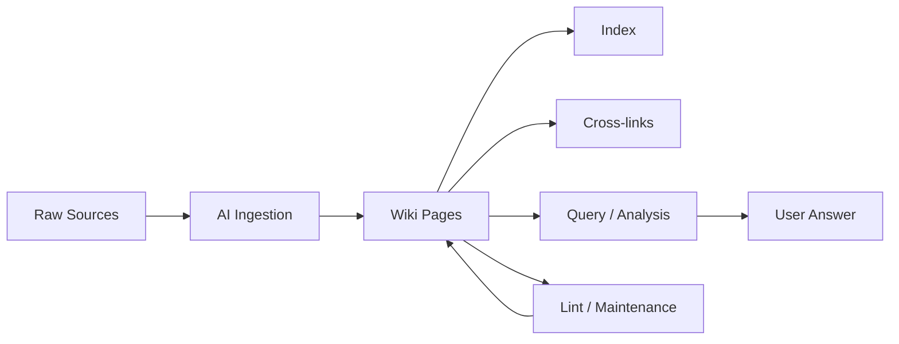

# Obsidian + AI: Second Brain, AI Database, LLM Wiki, and Provenance-Aware Knowledge Governance

> **Source:** [Lonely Octopus resource document](https://resource.lonelyoctopus.com/doc/ad5b2666-1a4c-4a5a-ae16-f34f622d42c8/)  
> **Original author:** Tina Huang  
> **Published:** September 2026  
>
> This Markdown file is a structured summary and implementation-oriented guide based on the source page. It is not a verbatim copy of the article. **Levels 1–3 summarize the source model; Level 4 is an extension added in this document to address provenance, false consensus, contradiction governance, and auditability.**

## Executive Summary

Obsidian works especially well with AI because an Obsidian vault is fundamentally a local collection of Markdown files. That gives AI agents a simple format they can search, read, edit, organize, and connect.

The source describes three levels of AI integration. This document extends that model with a fourth level: **Provenance-Aware Knowledge Governance**. Level 4 is an extension developed from the governance problem that appears once an AI is allowed to write, merge, prune, summarize, and resolve contradictions inside its own knowledge base.

| Level | Human role | AI role | Best fit |
|---|---|---|---|
| **1. AI Second Brain** | Writes and organizes knowledge | Retrieves, analyzes, and explains | People who already take notes |
| **2. AI Database** | Reviews and browses | Captures and writes knowledge | People who want AI to do the logging |
| **3. LLM Wiki** | Curates sources and asks questions | Ingests, writes, maintains, links, and retrieves | Research or knowledge systems that should compound over time |
| **4. Provenance-Aware Knowledge Governance** | Defines evidence and governance policy; reviews high-impact decisions | Tracks claims, provenance, conflicts, uncertainty, temporal validity, and audit history | Autonomous or long-lived knowledge systems where trust matters as much as retrieval |

The progression is no longer only about increasing AI autonomy. It is also about increasing epistemic control: first AI reads your notes, then AI writes them, then AI maintains the wiki, and finally the system must be able to explain **why it believes each important claim without turning its own summaries into artificial consensus**.

---

# 1. Why Obsidian Fits AI

Three properties make Obsidian particularly AI-friendly:

- **Markdown files:** plain-text files are easy for almost any agent or model-powered tool to process.
- **Linked notes:** `[[wikilinks]]` create explicit relationships between pages instead of leaving knowledge as isolated documents.
- **Local-first storage:** the vault remains a normal folder that can be accessed by local tools, coding agents, scripts, Git, or encrypted sync.

Obsidian also adds useful human-facing features such as backlinks, graph view, search, metadata, attachments, and plugins.

---

# 2. Level 1 — AI Second Brain

## Concept

You remain the primary writer.

AI acts as the retrieval and reasoning layer over your own notes.

```text
You write knowledge
      ↓
Obsidian vault
      ↓
AI searches + reads + reasons
      ↓
Answer / checklist / analysis / action
```

## Suggested Structure

```text
vault/
├── ME.md
├── MAP.md
├── SKILLS.md
├── notes/
│   ├── topic-a.md
│   ├── topic-b.md
│   └── process-notes.md
└── evidence/
    ├── screenshots/
    ├── exports/
    ├── statistics/
    └── reference-files/
```

### `ME.md`

Describe:

- who you are
- your role
- your priorities
- what you optimize for
- communication preferences
- important constraints

### `MAP.md`

Describe:

- folder structure
- important files
- naming conventions
- where different types of knowledge live
- how the agent should navigate the vault

### `SKILLS.md`

Describe what you want the AI to be able to do, for example:

- summarize project history
- build checklists
- compare ideas
- identify missing information
- produce reports from notes
- search evidence
- turn notes into implementation plans

## Workflow

1. Create an Obsidian vault.
2. Add the navigation/instruction files.
3. Store your normal notes as Markdown.
4. Keep raw supporting material separately.
5. Give an AI agent read access.
6. Ask questions against the vault rather than manually searching every note.

---

# 3. Level 2 — AI Database

## Concept

This reverses the Level 1 workflow.

Instead of requiring you to manually write everything, one or more agents capture information and save structured Markdown into the vault.

```text
Messages / events / research / activity
                ↓
             AI agent
                ↓
       Writes structured notes
                ↓
          Obsidian vault
                ↓
       Human or AI retrieves
```

## Good Data Sources

An AI database can collect:

- meeting notes
- research
- saved articles
- daily logs
- work sessions
- task history
- productivity records
- process documentation
- decisions
- recurring observations

## Important Design Rule

Do not let every agent invent its own format.

Define:

- filenames
- directories
- required metadata
- date format
- tags
- linking rules
- update rules

Example:

```yaml
---
type: meeting
date: 2026-10-07
project: ai-agent
participants:
  - person-a
  - person-b
tags:
  - meeting
  - ai
---
```

That consistency makes the vault easier for both humans and AI to search later.

---

# 4. Level 3 — LLM Wiki

## Concept

At this level, the AI becomes the primary maintainer of the knowledge base.

The human mainly:

- selects useful sources
- defines the domain
- asks questions
- reviews important conclusions

The AI:

- ingests material
- creates pages
- updates existing pages
- connects related concepts
- detects contradictions
- answers questions
- performs maintenance




---

# 5. Level 4 — Provenance-Aware Knowledge Governance

## Why Level 4 Is Different

Once an AI can write, merge, prune, summarize, and resolve contradictions, the central risk is no longer simply poor note-taking.

The new risk is **epistemic drift**: AI-generated summaries can be reused as inputs to later summaries until derived interpretations begin to look like independently confirmed facts.

A Level 4 system therefore treats **provenance, claim lineage, uncertainty, contradiction, and governance** as first-class data.

The core rule is:

> **Never allow derived knowledge to silently become primary evidence.**

```text
Raw Evidence
     ↓
Extracted Claims
     ↓
Provenance Graph
     ↓
Interpretations / Summaries
     ↓
Contradiction + Confidence Layer
     ↓
Governed Knowledge
     ↓
Answers
```

## 5.1 Separate Evidence From Interpretation

A governed system should distinguish at least these layers:

```text
SOURCE FACT
"Company reported revenue of $10M."

EXTRACTED CLAIM
"Revenue = $10M."

DERIVED INTERPRETATION
"Revenue increased significantly."

AI SUMMARY
"The company had strong financial growth."

CONSENSUS CLAIM
"Multiple independent sources indicate strong growth."
```

These are not interchangeable.

A summary is not a new source. An interpretation is not a primary fact. Repetition across several generated pages is not independent corroboration.

## 5.2 Claim-Level Knowledge

At Level 3, a Markdown page can function as the main unit of knowledge.

At Level 4, the more useful unit is the **atomic claim**.

Example:

```yaml
claim_id: claim-00231
statement: "Product X launched in September 2026."

status: supported
confidence: high

provenance:
  - source_id: source-019
    source_type: primary
    location: "release-notes.md#launch"
    extracted_at: 2026-10-07

derived_from: []

supports: []
contradicts:
  - claim-00184

valid_from: 2026-09-01
valid_until: null
superseded_by: null

last_verified: 2026-10-07
```

This allows the system to answer not only **what it believes**, but also:

- where the claim came from
- whether it is directly observed or derived
- which other claims support it
- which claims contradict it
- whether it is still current
- whether it has been superseded
- how confident the system is
- when it was last verified

## 5.3 Provenance Graph

Derived claims should preserve their full dependency chain.

```text
Source A
   ↓
Claim 1
   ↓
Summary B
   ↓
Claim 2
```

If `Claim 2` ultimately depends only on `Source A`, the system must not treat `Summary B` as a second independent source.

This prevents circular sourcing.

## 5.4 Consensus Must Be Source-Aware

Bad consensus calculation:

```text
5 wiki pages say X
→ X has strong consensus
```

Those five pages may all be generated from the same original article.

Better:

```text
5 claims support X
but all descend from Source A

Independent source count = 1
```

Consensus should be based on **independent evidence lineage**, not the number of pages, summaries, embeddings, or generated statements containing the same idea.

## 5.5 Preserve Contradictions

A contradiction should not normally be erased merely because the AI prefers one answer.

Bad:

```text
Source A says 100.
Source B says 120.

AI chooses 120 and overwrites the wiki.
```

Governed:

```yaml
conflict_id: conflict-0042
claim_a: claim-100
claim_b: claim-120
relationship: contradiction
resolution_status: unresolved

possible_explanations:
  - different measurement dates
  - different definitions
  - one source may be outdated
```

The AI may explain the disagreement, rank the evidence, or recommend a resolution, but the conflicting evidence should remain visible until the system has sufficient justification to supersede it.

## 5.6 Confidence Is Not Truth

Confidence and claim status should be separate.

For example:

```yaml
status: disputed
confidence: high
```

This can mean the system is highly confident that two credible sources genuinely disagree.

Useful statuses include:

```text
observed
supported
inferred
disputed
superseded
retracted
unverified
```

## 5.7 Temporal Validity

Knowledge changes.

A claim can be correct for one period and wrong later without either version being "bad data."

```yaml
valid_from: 2026-01-01
valid_until: 2026-06-30
superseded_by: claim-0488
```

Temporal metadata prevents the AI from merging historical and current truth into one timeless statement.

## 5.8 Govern Destructive Operations

High-impact operations should create an audit record, including:

- merge
- delete
- prune
- supersede
- contradiction resolution
- source credibility changes
- canonical entity changes
- bulk relinking
- schema migrations

For sensitive or high-impact knowledge, these actions should require human review before becoming canonical.

Example audit event:

```yaml
event_id: audit-2026-10-07-0041
action: supersede_claim
target: claim-00231
replacement: claim-00488
actor: ai-agent
reason: "New primary source provides updated launch date."
evidence:
  - source-044
requires_review: true
status: pending
```

## 5.9 Recommended Level 4 Structure

```text
knowledge-vault/
├── governance/
│   ├── SOURCE_POLICY.md
│   ├── CLAIM_POLICY.md
│   ├── MERGE_POLICY.md
│   └── CONFLICT_POLICY.md
│
├── raw/
│   └── immutable-sources/
│
├── claims/
│   └── atomic-claims/
│
├── wiki/
│   └── human-readable-synthesis/
│
├── provenance/
│   └── claim-source-relationships/
│
├── conflicts/
│   └── unresolved-contradictions/
│
├── decisions/
│   └── governance-decisions/
│
├── index.md
└── audit.log
```

The **wiki becomes a projection of the claim graph**, rather than the ultimate source of truth.

## 5.10 Level 3 vs Level 4

| Dimension | Level 3 — LLM Wiki | Level 4 — Knowledge Governance |
|---|---|---|
| Main goal | Maintain knowledge | Maintain trustworthy knowledge |
| AI can write | Yes | Yes |
| AI can merge | Yes | Yes, under provenance rules |
| Contradictions | Detect/manage | Preserve, explain, govern |
| Primary unit | Page | Claim |
| Sources | Referenced | Explicit dependency graph |
| AI summaries | Knowledge artifacts | Derived artifacts, never independent evidence |
| Consensus | Semantic agreement | Independent-source agreement |
| Historical truth | May be overwritten | Versioned and temporally scoped |
| Destructive changes | Agent-controlled | Audited and optionally approval-gated |
| Key question | "What do we know?" | "Why do we believe this?" |

---

# 6. Core LLM Wiki Architecture

A practical LLM Wiki has three conceptual layers.

## 5.1 Raw Sources

Original source material should remain unchanged.

Examples:

```text
raw/
├── articles/
├── papers/
├── transcripts/
├── images/
├── data/
└── attachments/
```

Treat these files as the source of truth.

## 5.2 Wiki

The AI-generated knowledge layer.

```text
wiki/
├── entities/
├── concepts/
├── comparisons/
├── summaries/
├── projects/
└── research/
```

Pages should synthesize information from one or more raw sources rather than simply duplicating them.

## 5.3 Schema / Agent Instructions

The agent needs a rules file that explains how the knowledge base works.

Common names include:

```text
AGENTS.md
CLAUDE.md
SCHEMA.md
SKILLS.md
```

This file should define:

- directory responsibilities
- file naming rules
- required metadata
- linking conventions
- ingestion rules
- update behavior
- contradiction handling
- query workflow
- maintenance workflow

---

# 7. Core Operations

## 7.1 Ingest

Purpose: add new information safely.

Recommended flow:

```text
Receive source
   ↓
Save immutable raw copy
   ↓
Extract important entities/concepts
   ↓
Search existing wiki
   ↓
Update existing pages or create new ones
   ↓
Update index
   ↓
Append activity log
```

Before creating a new page, search the existing wiki so the system does not generate duplicate pages for the same concept.

## 7.2 Query

Purpose: answer a question from accumulated knowledge.

Recommended flow:

1. Read the index.
2. Identify relevant pages.
3. Follow linked concepts.
4. Check the underlying sources when necessary.
5. Synthesize the answer.
6. Preserve useful new analysis back into the wiki when appropriate.

## 7.3 Lint

Purpose: keep the wiki healthy over time.

A lint pass can check for:

- contradictory claims
- stale information
- broken links
- orphan pages
- duplicate concepts
- missing sources
- weakly supported claims
- pages that have grown too large
- important concepts without dedicated pages

---

# 8. Navigation Files

## `index.md`

The index is content-oriented.

It should help both humans and agents discover the knowledge base quickly.

Example:

```markdown
# Wiki Index

## Concepts

- [[agent-memory]] — Persistent memory patterns for AI agents.
- [[llm-wiki]] — AI-maintained Markdown knowledge base.
- [[rag]] — Retrieval-augmented generation and related approaches.

## Projects

- [[internal-ai-assistant]] — Company AI assistant architecture and decisions.

## Research

- [[knowledge-management-tools]] — Comparison of knowledge-system approaches.
```

## `log.md`

The log is chronological and append-only.

Example:

```markdown
# Wiki Log

## [2026-10-07] ingest | Obsidian + AI article

- Saved original source.
- Created `[[llm-wiki]]`.
- Updated `[[obsidian]]`.
- Added relationships to `[[second-brain]]`.

## [2026-10-07] query | Compare RAG and LLM Wiki

- Reviewed relevant concept pages.
- Created comparison note.
```

---

# 9. Recommended Page Types

A mature wiki benefits from multiple page types.

## Entity Page

Use for a person, company, product, tool, project, or other important object.

```markdown
# Entity Name

## Overview

## Key Facts

## Relationships

## Important Events

## Sources
```

## Concept Page

Use for an idea or technical concept.

```markdown
# Concept Name

## Definition

## Current Understanding

## Related Concepts

## Open Questions

## Sources
```

## Comparison Page

Use when comparing approaches.

```markdown
# A vs B

## Purpose

## Comparison

| Dimension | A | B |
|---|---|---|
| Strength | ... | ... |
| Weakness | ... | ... |
| Best use | ... | ... |

## Conclusion

## Sources
```

---

# 10. Suggested Production Vault

This structure combines the ideas from the source with practical LLM Wiki patterns.

```text
ai-knowledge-vault/
├── AGENTS.md
├── ME.md
├── MAP.md
├── index.md
├── log.md
├── audit.log
│
├── governance/
│   ├── SOURCE_POLICY.md
│   ├── CLAIM_POLICY.md
│   ├── MERGE_POLICY.md
│   └── CONFLICT_POLICY.md
│
├── raw/
│   ├── articles/
│   ├── papers/
│   ├── transcripts/
│   ├── images/
│   └── data/
│
├── claims/
│   ├── observed/
│   ├── inferred/
│   ├── disputed/
│   └── superseded/
│
├── provenance/
│   ├── source-map/
│   └── claim-lineage/
│
├── conflicts/
│   ├── unresolved/
│   └── resolved/
│
├── decisions/
│   └── governance/
│
├── wiki/
│   ├── entities/
│   ├── concepts/
│   ├── comparisons/
│   ├── summaries/
│   └── research/
│
├── notes/
│   ├── personal/
│   ├── projects/
│   └── meetings/
│
├── evidence/
│   ├── screenshots/
│   ├── exports/
│   └── attachments/
│
└── archive/
```

---

# 11. Agent Safety Rules

An autonomous knowledge agent should follow strict boundaries.

```markdown
## Knowledge Base Rules

1. Never modify files under `raw/`.
2. Never delete source evidence automatically.
3. Search before creating a new wiki page or claim.
4. Prefer updating an existing concept over creating duplicates.
5. Every important factual claim must retain provenance to its source.
6. Never count an AI-generated summary as an independent corroborating source.
7. Preserve claim lineage when creating derived statements.
8. Mark unresolved contradictions instead of silently choosing one version.
9. Keep confidence separate from truth/status.
10. Preserve temporal validity and superseded historical claims.
11. Keep `log.md` and `audit.log` append-only.
12. Update `index.md` whenever important pages are created or archived.
13. Do not convert uncertain or inferred information into a confirmed fact.
14. Audit merges, deletions, superseding, contradiction resolutions, and source-credibility changes.
15. Require human review for destructive or high-impact canonical changes.
```

---

# 12. Choosing the Right Level

## Use Level 1 when

- you already maintain useful notes
- you want AI search and reasoning
- you do not want AI writing into your vault automatically
- personal control is the priority

## Use Level 2 when

- manual logging is the main problem
- data arrives continuously
- you want agents to capture routine information
- humans still want to browse the vault directly

## Use Level 3 when

- the knowledge base is large
- information changes continuously
- cross-referencing is important
- research accumulates for months
- maintaining pages manually is too expensive
- you want AI to operate the knowledge system as infrastructure

## Use Level 4 when

- AI-generated summaries may later be reused as knowledge inputs
- multiple agents write into the same knowledge base
- evidence can conflict or change over time
- independent-source consensus matters
- you need to distinguish observation, inference, summary, and interpretation
- claim history and auditability are required
- destructive knowledge operations must be reviewable
- the cost of a coherent but false consensus is high

---

# 13. Maturity Path

You do not need to start with a fully autonomous wiki.

A safer progression is:

```text
Phase 1 — Level 1
Human writes → AI reads

Phase 2 — Level 2
AI captures selected records → Human reviews and retrieves

Phase 3 — Level 3
AI ingests + synthesizes + maintains the wiki

Phase 4 — Level 4
AI maintains claims + provenance + contradictions + temporal validity
→ destructive changes are audited
→ high-impact decisions can require human review
```

This lets you validate conventions before giving the agent broader write access.

---

# 14. Practical Example

Suppose you want a software-development knowledge vault.

```text
raw/
├── release-notes/
├── incident-reports/
├── requirement-docs/
└── code-review-notes/

wiki/
├── entities/
│   ├── projects/
│   ├── services/
│   └── teams/
├── concepts/
│   ├── authentication.md
│   ├── caching.md
│   └── deployment.md
└── comparisons/

notes/
├── meetings/
└── decisions/
```

An agent could receive a new incident report and:

1. store the original report in `raw/incident-reports/`
2. extract atomic claims and link every claim back to the exact source
3. identify affected services
4. search for existing claims before creating new ones
5. update the relevant service pages as derived views
6. create or update the related failure-mode page
7. link the incident to prior similar incidents
8. record conflicting claims instead of overwriting them
9. preserve the lineage of any generated conclusion
10. update `index.md`
11. append the operation to `log.md`
12. append any merge, supersede, or contradiction-resolution action to `audit.log`

Later, you could ask:

> What recurring causes have produced notification failures across our desktop releases?

The agent would search the compiled wiki rather than treating every source as a completely new problem.

---

# 15. Key Design Principles

- **Keep raw evidence immutable.**
- **Separate sources from generated knowledge.**
- **Never allow derived knowledge to silently become primary evidence.**
- **Treat important claims as traceable objects, not just prose inside pages.**
- **Preserve source-to-claim-to-summary lineage.**
- **Measure consensus by independent evidence, not repeated AI-generated statements.**
- **Preserve contradictions until there is an auditable reason to supersede one side.**
- **Keep confidence separate from claim status.**
- **Track temporal validity so historical and current truth are not merged.**
- **Use Markdown as the human-readable storage and projection layer.**
- **Create explicit links between related pages and claims.**
- **Give the AI a schema and governance policy instead of letting it improvise.**
- **Search before creating new pages or claims.**
- **Maintain a global index.**
- **Keep append-only activity and governance audit logs.**
- **Run periodic lint, provenance, contradiction, and orphan-claim checks.**
- **Use human review for destructive or high-impact changes.**
- **Start simple and add autonomy only when the structure is stable.**

---

# 16. Source Resources

## Main Article

- [Obsidian + AI: How to Build a Second Brain, an AI Database, or an LLM Wiki](https://resource.lonelyoctopus.com/doc/ad5b2666-1a4c-4a5a-ae16-f34f622d42c8/)

## Video

- [Original video referenced by the resource page](https://www.youtube.com/watch?v=4Hvkv_I8QDE)

## Additional Resources Linked from the Page

- [AI Second Brain implementation — YouTube](https://youtu.be/rRa9td4oe7k)
- [AI Second Brain example/commentary — YouTube](https://youtu.be/bdjYo-x4PUw)
- [AI productivity/database example — YouTube](https://youtu.be/NMYQt25otes)
- [Andrej Karpathy — LLM Wiki Gist](https://gist.github.com/karpathy/442a6bf555914893e9891c11519de94f)
- [LLM Wiki implementation — GitHub](https://github.com/nvk/llm-wiki)
- [Hermes Agent — LLM Wiki Skill](https://hermes-agent.nousresearch.com/docs/user-guide/skills/bundled/research/research-llm-wiki)

---

# 17. Final Mental Model

```text
LEVEL 1 — AI SECOND BRAIN
Human writes → AI retrieves and reasons

LEVEL 2 — AI DATABASE
AI captures and writes → Human browses and reviews

LEVEL 3 — LLM WIKI
AI writes + organizes + links + maintains + retrieves

LEVEL 4 — PROVENANCE-AWARE KNOWLEDGE GOVERNANCE
AI maintains knowledge
+
tracks evidence lineage
+
preserves uncertainty
+
prevents circular sourcing
+
measures independent consensus
+
governs contradictions
+
tracks temporal validity
+
audits destructive knowledge changes
```

The important shift is not simply adding a chatbot to notes. The system evolves from a note repository into durable knowledge infrastructure.

At Level 4, the defining question changes from:

> **"What do we know?"**

to:

> **"Why do we believe this, which independent evidence supports it, what conflicts with it, and can we reconstruct how this conclusion was produced?"**

That is the layer that prevents an autonomous wiki from slowly turning its own summaries into false consensus.
