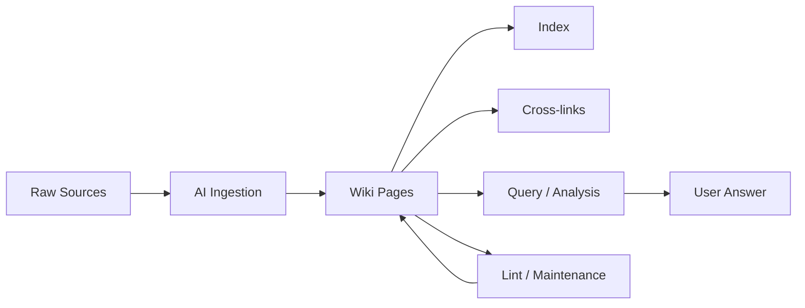

# Obsidian + AI: Second Brain, AI Database, and LLM Wiki

> **Source:** [Lonely Octopus resource document](https://resource.lonelyoctopus.com/doc/ad5b2666-1a4c-4a5a-ae16-f34f622d42c8/)  
> **Original author:** Tina Huang  
> **Published:** September 2026  
>
> This Markdown file is a structured summary and implementation-oriented guide based on the source page. It is not a verbatim copy of the article.

## Executive Summary

Obsidian works especially well with AI because an Obsidian vault is fundamentally a local collection of Markdown files. That gives AI agents a simple format they can search, read, edit, organize, and connect.

The source describes three levels of AI integration:

| Level | Human role | AI role | Best fit |
|---|---|---|---|
| **1. AI Second Brain** | Writes and organizes knowledge | Retrieves, analyzes, and explains | People who already take notes |
| **2. AI Database** | Reviews and browses | Captures and writes knowledge | People who want AI to do the logging |
| **3. LLM Wiki** | Curates sources and asks questions | Ingests, writes, maintains, links, and retrieves | Research or knowledge systems that should compound over time |

The progression is simple: first AI reads your notes, then AI starts writing the notes, and finally AI manages the knowledge system itself.

---

# 1. Why Obsidian Fits AI

Three properties make Obsidian particularly AI-friendly:

- **Markdown files:** plain-text files are easy for almost any agent or model-powered tool to process.
- **Linked notes:** `[[wikilinks]]` create explicit relationships between pages instead of leaving knowledge as isolated documents.
- **Local-first storage:** the vault remains a normal folder that can be accessed by local tools, coding agents, scripts, Git, or encrypted sync.

Obsidian also adds useful human-facing features such as backlinks, graph view, search, metadata, attachments, and plugins.

---

# 2. Level 1 — AI Second Brain

## Concept

You remain the primary writer.

AI acts as the retrieval and reasoning layer over your own notes.

```text
You write knowledge
      ↓
Obsidian vault
      ↓
AI searches + reads + reasons
      ↓
Answer / checklist / analysis / action
```

## Suggested Structure

```text
vault/
├── ME.md
├── MAP.md
├── SKILLS.md
├── notes/
│   ├── topic-a.md
│   ├── topic-b.md
│   └── process-notes.md
└── evidence/
    ├── screenshots/
    ├── exports/
    ├── statistics/
    └── reference-files/
```

### `ME.md`

Describe:

- who you are
- your role
- your priorities
- what you optimize for
- communication preferences
- important constraints

### `MAP.md`

Describe:

- folder structure
- important files
- naming conventions
- where different types of knowledge live
- how the agent should navigate the vault

### `SKILLS.md`

Describe what you want the AI to be able to do, for example:

- summarize project history
- build checklists
- compare ideas
- identify missing information
- produce reports from notes
- search evidence
- turn notes into implementation plans

## Workflow

1. Create an Obsidian vault.
2. Add the navigation/instruction files.
3. Store your normal notes as Markdown.
4. Keep raw supporting material separately.
5. Give an AI agent read access.
6. Ask questions against the vault rather than manually searching every note.

---

# 3. Level 2 — AI Database

## Concept

This reverses the Level 1 workflow.

Instead of requiring you to manually write everything, one or more agents capture information and save structured Markdown into the vault.

```text
Messages / events / research / activity
                ↓
             AI agent
                ↓
       Writes structured notes
                ↓
          Obsidian vault
                ↓
       Human or AI retrieves
```

## Good Data Sources

An AI database can collect:

- meeting notes
- research
- saved articles
- daily logs
- work sessions
- task history
- productivity records
- process documentation
- decisions
- recurring observations

## Important Design Rule

Do not let every agent invent its own format.

Define:

- filenames
- directories
- required metadata
- date format
- tags
- linking rules
- update rules

Example:

```yaml
---
type: meeting
date: 2026-10-07
project: ai-agent
participants:
  - person-a
  - person-b
tags:
  - meeting
  - ai
---
```

That consistency makes the vault easier for both humans and AI to search later.

---

# 4. Level 3 — LLM Wiki

## Concept

At this level, the AI becomes the primary maintainer of the knowledge base.

The human mainly:

- selects useful sources
- defines the domain
- asks questions
- reviews important conclusions

The AI:

- ingests material
- creates pages
- updates existing pages
- connects related concepts
- detects contradictions
- answers questions
- performs maintenance



---

# 5. Core LLM Wiki Architecture

A practical LLM Wiki has three conceptual layers.

## 5.1 Raw Sources

Original source material should remain unchanged.

Examples:

```text
raw/
├── articles/
├── papers/
├── transcripts/
├── images/
├── data/
└── attachments/
```

Treat these files as the source of truth.

## 5.2 Wiki

The AI-generated knowledge layer.

```text
wiki/
├── entities/
├── concepts/
├── comparisons/
├── summaries/
├── projects/
└── research/
```

Pages should synthesize information from one or more raw sources rather than simply duplicating them.

## 5.3 Schema / Agent Instructions

The agent needs a rules file that explains how the knowledge base works.

Common names include:

```text
AGENTS.md
CLAUDE.md
SCHEMA.md
SKILLS.md
```

This file should define:

- directory responsibilities
- file naming rules
- required metadata
- linking conventions
- ingestion rules
- update behavior
- contradiction handling
- query workflow
- maintenance workflow

---

# 6. Core Operations

## 6.1 Ingest

Purpose: add new information safely.

Recommended flow:

```text
Receive source
   ↓
Save immutable raw copy
   ↓
Extract important entities/concepts
   ↓
Search existing wiki
   ↓
Update existing pages or create new ones
   ↓
Update index
   ↓
Append activity log
```

Before creating a new page, search the existing wiki so the system does not generate duplicate pages for the same concept.

## 6.2 Query

Purpose: answer a question from accumulated knowledge.

Recommended flow:

1. Read the index.
2. Identify relevant pages.
3. Follow linked concepts.
4. Check the underlying sources when necessary.
5. Synthesize the answer.
6. Preserve useful new analysis back into the wiki when appropriate.

## 6.3 Lint

Purpose: keep the wiki healthy over time.

A lint pass can check for:

- contradictory claims
- stale information
- broken links
- orphan pages
- duplicate concepts
- missing sources
- weakly supported claims
- pages that have grown too large
- important concepts without dedicated pages

---

# 7. Navigation Files

## `index.md`

The index is content-oriented.

It should help both humans and agents discover the knowledge base quickly.

Example:

```markdown
# Wiki Index

## Concepts

- [[agent-memory]] — Persistent memory patterns for AI agents.
- [[llm-wiki]] — AI-maintained Markdown knowledge base.
- [[rag]] — Retrieval-augmented generation and related approaches.

## Projects

- [[internal-ai-assistant]] — Company AI assistant architecture and decisions.

## Research

- [[knowledge-management-tools]] — Comparison of knowledge-system approaches.
```

## `log.md`

The log is chronological and append-only.

Example:

```markdown
# Wiki Log

## [2026-10-07] ingest | Obsidian + AI article

- Saved original source.
- Created `[[llm-wiki]]`.
- Updated `[[obsidian]]`.
- Added relationships to `[[second-brain]]`.

## [2026-10-07] query | Compare RAG and LLM Wiki

- Reviewed relevant concept pages.
- Created comparison note.
```

---

# 8. Recommended Page Types

A mature wiki benefits from multiple page types.

## Entity Page

Use for a person, company, product, tool, project, or other important object.

```markdown
# Entity Name

## Overview

## Key Facts

## Relationships

## Important Events

## Sources
```

## Concept Page

Use for an idea or technical concept.

```markdown
# Concept Name

## Definition

## Current Understanding

## Related Concepts

## Open Questions

## Sources
```

## Comparison Page

Use when comparing approaches.

```markdown
# A vs B

## Purpose

## Comparison

| Dimension | A | B |
|---|---|---|
| Strength | ... | ... |
| Weakness | ... | ... |
| Best use | ... | ... |

## Conclusion

## Sources
```

---

# 9. Suggested Production Vault

This structure combines the ideas from the source with practical LLM Wiki patterns.

```text
ai-knowledge-vault/
├── AGENTS.md
├── ME.md
├── MAP.md
├── index.md
├── log.md
│
├── raw/
│   ├── articles/
│   ├── papers/
│   ├── transcripts/
│   ├── images/
│   └── data/
│
├── wiki/
│   ├── entities/
│   ├── concepts/
│   ├── comparisons/
│   ├── summaries/
│   └── research/
│
├── notes/
│   ├── personal/
│   ├── projects/
│   └── meetings/
│
├── evidence/
│   ├── screenshots/
│   ├── exports/
│   └── attachments/
│
└── archive/
```

---

# 10. Agent Safety Rules

An autonomous knowledge agent should follow strict boundaries.

```markdown
## Knowledge Base Rules

1. Never modify files under `raw/`.
2. Never delete source evidence automatically.
3. Search before creating a new wiki page.
4. Prefer updating an existing concept over creating duplicates.
5. Every factual wiki page should retain source references.
6. Mark unresolved contradictions instead of silently choosing one version.
7. Keep `log.md` append-only.
8. Update `index.md` whenever important pages are created or archived.
9. Do not convert uncertain information into a confirmed fact.
10. Ask for human review before destructive structural changes.
```

---

# 11. Choosing the Right Level

## Use Level 1 when

- you already maintain useful notes
- you want AI search and reasoning
- you do not want AI writing into your vault automatically
- personal control is the priority

## Use Level 2 when

- manual logging is the main problem
- data arrives continuously
- you want agents to capture routine information
- humans still want to browse the vault directly

## Use Level 3 when

- the knowledge base is large
- information changes continuously
- cross-referencing is important
- research accumulates for months
- maintaining pages manually is too expensive
- you want AI to operate the knowledge system as infrastructure

---

# 12. Maturity Path

You do not need to start with a fully autonomous wiki.

A safer progression is:

```text
Phase 1
Human writes → AI reads

Phase 2
Human writes + AI writes selected records

Phase 3
AI ingests and maintains selected knowledge areas

Phase 4
AI manages the wiki with logs, linting, indexing, and human review
```

This lets you validate conventions before giving the agent broader write access.

---

# 13. Practical Example

Suppose you want a software-development knowledge vault.

```text
raw/
├── release-notes/
├── incident-reports/
├── requirement-docs/
└── code-review-notes/

wiki/
├── entities/
│   ├── projects/
│   ├── services/
│   └── teams/
├── concepts/
│   ├── authentication.md
│   ├── caching.md
│   └── deployment.md
└── comparisons/

notes/
├── meetings/
└── decisions/
```

An agent could receive a new incident report and:

1. store the original report in `raw/incident-reports/`
2. identify affected services
3. update the relevant service pages
4. create or update the related failure-mode page
5. link the incident to prior similar incidents
6. update `index.md`
7. append the operation to `log.md`

Later, you could ask:

> What recurring causes have produced notification failures across our desktop releases?

The agent would search the compiled wiki rather than treating every source as a completely new problem.

---

# 14. Key Design Principles

- **Keep raw evidence immutable.**
- **Separate sources from generated knowledge.**
- **Use Markdown as the common storage format.**
- **Create explicit links between related pages.**
- **Give the AI a schema instead of letting it improvise.**
- **Search before creating new pages.**
- **Maintain a global index.**
- **Keep an append-only activity log.**
- **Run periodic lint/health checks.**
- **Preserve uncertainty and conflicting evidence.**
- **Use human review for destructive or high-impact changes.**
- **Start simple and add autonomy only when the structure is stable.**

---

# 15. Source Resources

## Main Article

- [Obsidian + AI: How to Build a Second Brain, an AI Database, or an LLM Wiki](https://resource.lonelyoctopus.com/doc/ad5b2666-1a4c-4a5a-ae16-f34f622d42c8/)

## Video

- [Original video referenced by the resource page](https://www.youtube.com/watch?v=4Hvkv_I8QDE)

## Additional Resources Linked from the Page

- [AI Second Brain implementation — YouTube](https://youtu.be/rRa9td4oe7k)
- [AI Second Brain example/commentary — YouTube](https://youtu.be/bdjYo-x4PUw)
- [AI productivity/database example — YouTube](https://youtu.be/NMYQt25otes)
- [Andrej Karpathy — LLM Wiki Gist](https://gist.github.com/karpathy/442a6bf555914893e9891c11519de94f)
- [LLM Wiki implementation — GitHub](https://github.com/nvk/llm-wiki)
- [Hermes Agent — LLM Wiki Skill](https://hermes-agent.nousresearch.com/docs/user-guide/skills/bundled/research/research-llm-wiki)

---

# 16. Final Mental Model

```text
AI SECOND BRAIN
You write → AI understands

AI DATABASE
AI writes → You browse

LLM WIKI
AI writes + organizes + maintains + retrieves
```

The important shift is not simply adding a chatbot to notes. The goal is to create a durable knowledge system where information can accumulate, remain structured, and become easier to use over time.
