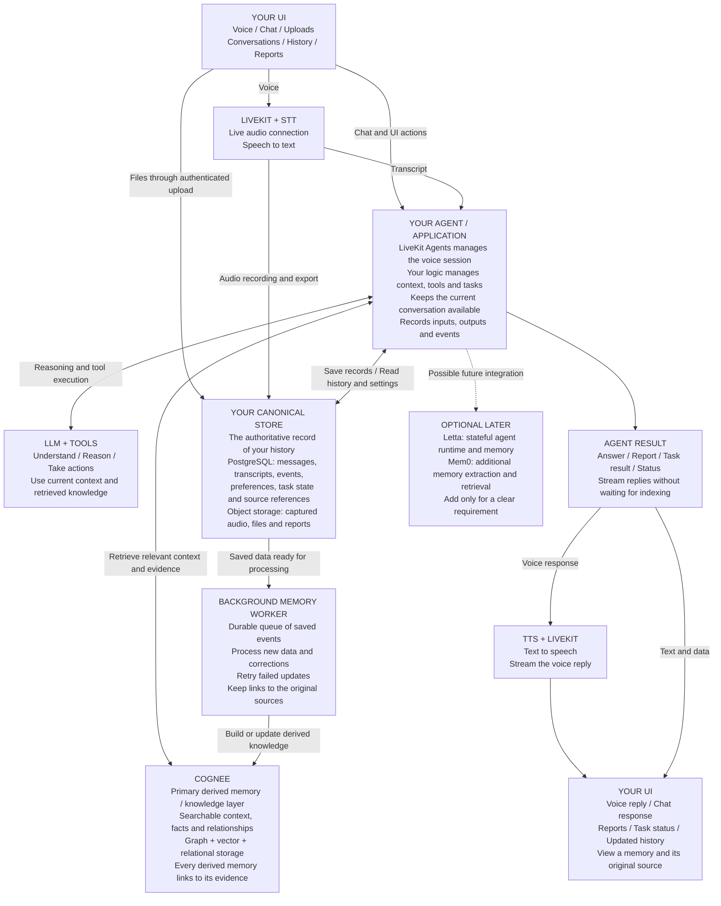

# Recommended Second Brain Stack

**Your own storage keeps the history. Cognee builds searchable knowledge from it. Your agent uses both to help you.**

Start with LiveKit, your application logic, an LLM and speech providers, PostgreSQL, object storage, Cognee, and a background worker. Letta and Mem0 remain optional.

The single diagram below uses simple boxes and arrows. It renders in Markdown viewers that support Mermaid. Boxes describe responsibilities; they do not each require a separate server. The two UI boxes represent the same application.

**How to read this architecture**

- **LiveKit handles the live connection.** LiveKit Agents manages the voice session, including the speech pipeline and turn handling. Your application logic can run within that runtime initially and be reused for text. [LiveKit sessions](https://docs.livekit.io/agents/logic/sessions/)
- **Your storage owns the history.** Save original inputs and record transcripts, outputs, tool outcomes and corrections as they become available. Read exact history, settings and task status directly from this store.
- **Cognee supplies connected context.** Its documented architecture combines relational, vector and graph storage. Keeping it as a derived layer is the design recommended here. [Cognee architecture](https://docs.cognee.ai/core-concepts/architecture)
- **The worker updates knowledge in the background.** Save the source event and its pending processing job together. Recent conversation context stays available to the agent while indexing catches up. Cognee retrieval sees only data that has completed indexing. [Cognee recall](https://docs.cognee.ai/core-concepts/main-operations/recall)
- **Your agent produces the final answer.** Use Cognee's context-only retrieval when supplying evidence to your own conversational LLM. [Cognee retrieval options](https://docs.cognee.ai/core-concepts/main-operations/recall)
- **Recording is explicit.** Configure audio capture/export; a live connection alone is not an archive. [LiveKit recording and export](https://docs.livekit.io/transport/media/ingress-egress/egress/)
- **Optional components attach to the application.** Letta would affect who owns agent execution; Mem0 overlaps with memory extraction and retrieval. Neither is a required child of Cognee. [Letta stateful agents](https://docs.letta.com/v1-sdk/concepts/stateful-agents/), [Mem0 overview](https://docs.mem0.ai/platform/overview)

**Audit of your two points**

| Point | Verdict | Wording to adopt |
| --- | --- | --- |
| 1. Cognee is a derived knowledge layer, not the canonical memory source. | **Correct for this architecture. Adopt it.** | Cognee is the primary derived memory and knowledge layer. Your canonical store is the authoritative record of personal history. |
| 2. Preserve original records first and attach provenance to derived memories. | **Correct in principle. Adopt it with the timing and retention clarifications below.** | Preserve source records independently, then derive searchable knowledge from saved data. Every derived memory must be traceable to its supporting sources. |

**Clarifications that matter**

1. **“Save first” means before durable knowledge extraction.** Capture live audio continuously and save events as they happen. Do not wait for the entire audio file, conversation or Cognee update to finish before responding. Transcripts, assistant outputs and tool results are recorded when available.
2. **“Every original record” means everything you choose to retain.** Set an explicit recording and retention policy. Corrections and deletions must also reach derived memories, indexes and caches; an archive should not make deletion ineffective.
3. **A transcript is derived from audio.** Keep its version and audio reference. Preserve the original captured recording when enabled, and distinguish what was generated from what the user actually heard before an interruption.
4. **Provenance needs an exact location.** Keep the source record ID, source version, speaker or author, timestamp, and the relevant message, document passage or audio time range. A memory may require several supporting sources. Also record whether it is inferred, user-confirmed, corrected or superseded.
5. **A source link is evidence, not proof of truth.** A source can contain a mistake. Your store is authoritative about what was recorded; extracted claims still need interpretation. Preserve confirmed preferences and user corrections in your own records too.
6. **Years of traceability require durable preservation.** Maintain backups, source versions and stable references. If a source is intentionally deleted, mark its evidence unavailable and remove or revise dependent memories according to your policy. Never pretend the evidence still exists.
7. **Replacement preserves history, not identical behavior.** You can rebuild searchable knowledge from retained sources, but a different model or memory engine may produce different extractions. Keep valuable user corrections and confirmed facts independently of Cognee.

**Recommended principle to adopt**

> Preserve the records you choose to retain in your own canonical store as they become available. Build Cognee's searchable knowledge from those saved records in the background. Keep an exact, versioned source reference for every derived memory so you can inspect, correct or delete it later. Your agent uses current conversation context, authoritative application records and retrieved knowledge to respond.

The audit is an architectural recommendation based on the official documentation linked above; automatic end-to-end provenance, retention and deletion must be designed and verified in your application.
