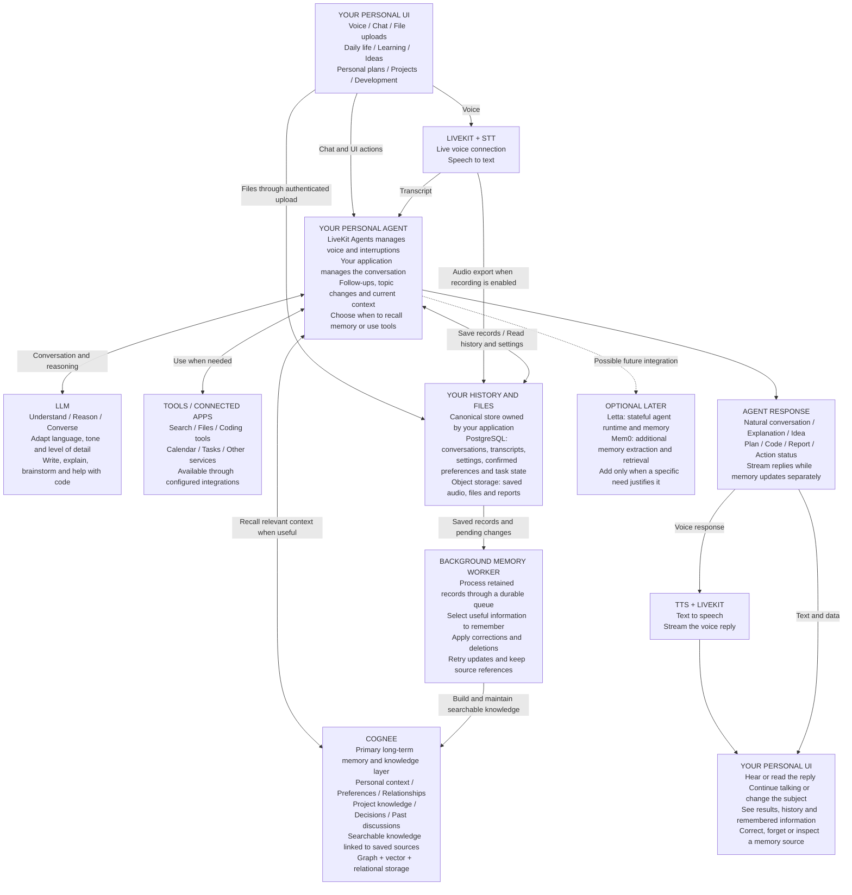

# Recommended Personal Second Brain Stack

**One personal assistant for everyday conversation, personal life, learning, ideas, planning, projects and development.**

Talk naturally by voice or text. Change subjects, ask follow-up questions, think aloud, discuss a personal concern, or work through a technical problem. The assistant uses the current conversation, brings in relevant memories when useful, and uses tools when a request needs information or action.

Start with **your UI + LiveKit Agents + your application logic + LLM/STT/TTS providers + PostgreSQL + object storage + Cognee + a background worker**. Letta and Mem0 remain optional.

The diagram shows responsibilities, not separate servers. The two UI boxes are the same application. It renders in Markdown viewers with Mermaid support.

**How it should behave in daily life**

- **Conversation is the default.** A greeting, a casual thought or a general question can receive a direct reply. The agent does not need to search old memories or start a task for every message.
- **Follow the conversation naturally.** Keep recent turns available, understand references such as “that idea,” and ask a short question when the meaning is unclear. Carry context between voice and text within the same conversation.
- **Personalize appropriately.** Use the user's preferred language, tone and level of detail. Respond considerately to personal topics without inventing feelings, experiences or facts about the user.
- **Recall selectively.** Bring in past information when it helps. Keep personal context and each project's knowledge separately scoped so unrelated details do not appear in the answer. Connect them when the request calls for it.
- **Switch between talking and doing.** Discuss an idea conversationally, then turn it into a plan, document, development task or connected-app action when requested. Tool capabilities depend on the integrations actually configured.
- **Keep longer work separate from the live voice turn.** Track a long task and its progress durably so conversation can continue. Scheduled reminders need a scheduler and notification integration when that feature is added.
- **Let the user control memory.** Support requests such as “remember this,” “that changed,” and “forget that.” Explain the difference between removing a remembered fact and deleting its original conversation. Make recording and retention choices visible in settings.

**What each layer owns**

| Layer | Plain meaning |
| --- | --- |
| Current conversation | What we are discussing now; available immediately to the agent |
| Your history and files | The retained record of what was said, saved or done, plus settings and task state |
| Cognee | Searchable knowledge built from those records, used to recall useful personal and project context |
| LLM | The model that understands the request and generates the response |
| Tools | Configured capabilities for obtaining information and carrying out requested work |

Save records as they become available, and build long-term knowledge from saved data in the background. A reply should not wait for an entire recording or memory-indexing job to finish. Keep source references and corrections so a remembered claim can be checked against the relevant message, file passage or audio segment. A saved statement records what someone said; it is not automatically a verified fact.

Keep original records, confirmed preferences and important corrections independently of the memory engine. Maintain backups and propagate applicable deletions to derived knowledge. If a provider changes, retained records can support rebuilding memory, although the resulting extractions may differ.

LiveKit Agents supplies the voice-session framework; your application supplies these conversation and memory rules. Naturalness depends on the selected models, speech quality, latency and conversation design, so validate casual conversation, topic changes, corrections and project switching before treating the experience as complete. [LiveKit sessions](https://docs.livekit.io/agents/logic/sessions/)

Cognee combines graph, vector and relational storage and can return retrieved context for your own LLM. Using it for long-term recall alongside application-owned history is the architecture recommended here. [Cognee architecture](https://docs.cognee.ai/core-concepts/architecture), [Cognee retrieval](https://docs.cognee.ai/core-concepts/main-operations/recall)
