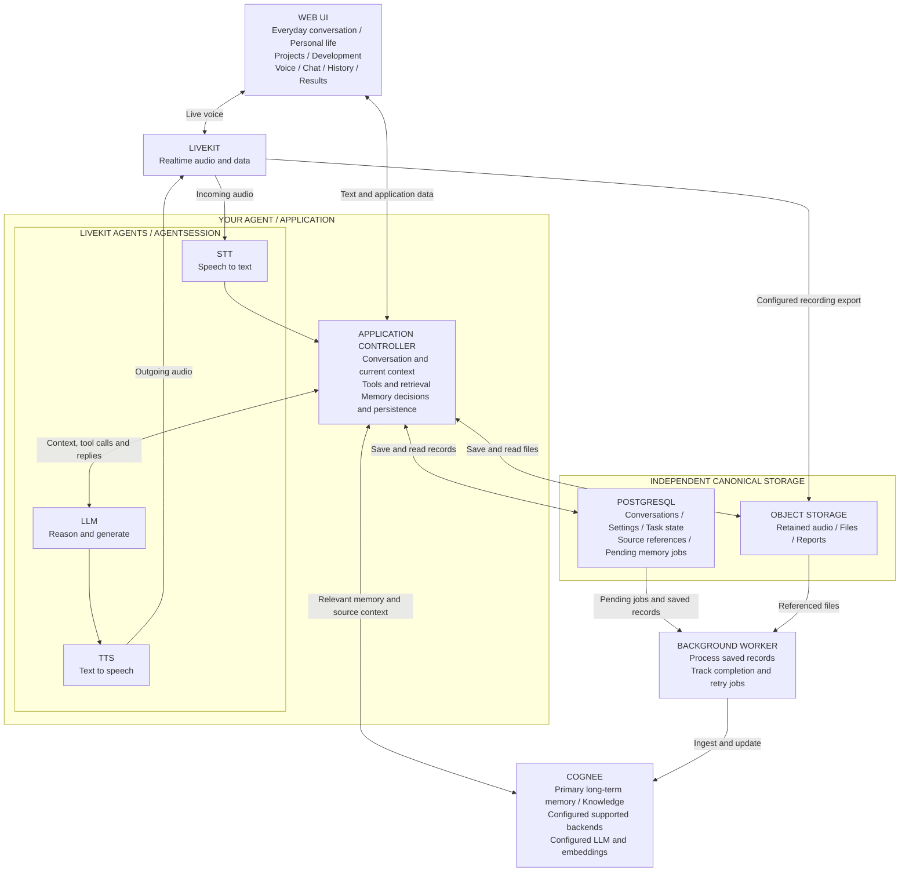

# Recommended Personal Second Brain Stack

**One personal assistant for everyday conversation, personal life, learning, planning, projects and development.**

Talk naturally by voice or text. The agent follows the current conversation, retrieves relevant memories when useful, and uses configured tools when a request needs information or action.

The recommended starting stack is **Web UI + LiveKit + LiveKit Agents + your application logic + STT/LLM/TTS providers + PostgreSQL + object storage + Cognee + background memory processing**. Letta and Mem0 remain optional.

Reviewed against current official documentation and repositories on **7 September 2026**. “PROVEN” below means documented capability, not a tested deployment of this complete application.

**1. Four-change verdict**

| Change | Verdict | Short reason | Official source |
| --- | --- | --- | --- |
| STT / LLM / TTS is the voice pipeline under the agent. | **PROVEN** | AgentSession manages the configured speech and language models. LiveKit transport stays outside the model pipeline. | [Pipeline types](https://docs.livekit.io/agents/models/pipelines/), [Sessions](https://docs.livekit.io/agents/logic/sessions/) |
| Your agent is the application-level controller. | **PARTIALLY PROVEN** | Conversation orchestration, tools and retrieval hooks are documented. Memory decisions and canonical persistence must be implemented by your application. | [Sessions](https://docs.livekit.io/agents/logic/sessions/), [Agent hooks](https://docs.livekit.io/agents/logic/nodes/) |
| Cognee is the primary long-term memory/knowledge layer, with configurable backends. | **PROVEN** | Persistent knowledge and retrieval are supported. “Primary” is the role selected for this architecture; the backend providers remain a deployment choice. | [Official repository](https://github.com/topoteretes/cognee), [Configuration](https://docs.cognee.ai/setup-configuration/overview) |
| Canonical data is persisted independently, with asynchronous memory processing. | **PARTIALLY PROVEN** | PostgreSQL transactions and Cognee background ingestion are documented. Durable jobs, completion tracking and retries connecting them are application work. | [PostgreSQL transactions](https://www.postgresql.org/docs/current/tutorial-transactions.html), [Cognee ingestion](https://docs.cognee.ai/core-concepts/main-operations/remember) |

**2. Verified stack**

| Component | Role in this design |
| --- | --- |
| **Web UI** | Voice/chat interface, history, files and results. An official React/Next.js starter is available; personal and project screens are application features. [Starter apps](https://docs.livekit.io/frontends/start/starter-apps/) |
| **LiveKit** | Realtime media and data transport. Recording/export is configured explicitly. [Text support](https://docs.livekit.io/agents/multimodality/text/), [Recording/export](https://docs.livekit.io/transport/media/ingress-egress/egress/) |
| **LiveKit Agents** | AgentSession, voice turns, interruptions, conversation context and application hooks. [Sessions](https://docs.livekit.io/agents/logic/sessions/) |
| **Your application controller** | Chooses context, calls tools, retrieves memory and saves records. These are responsibilities implemented through the framework. [Agent hooks](https://docs.livekit.io/agents/logic/nodes/) |
| **STT / LLM / TTS** | Speech recognition, reasoning and response generation, and speech synthesis under AgentSession. [Models](https://docs.livekit.io/agents/models/) |
| **PostgreSQL** | Application-owned conversations, settings, confirmed preferences, task state, source references and pending memory jobs. [Transactions](https://www.postgresql.org/docs/current/tutorial-transactions.html) |
| **Object storage** | Retained audio, uploaded files and generated artifacts. Select a provider compatible with the chosen upload and export paths. [Egress outputs](https://docs.livekit.io/transport/media/ingress-egress/egress/outputs/) |
| **Cognee** | Long-term knowledge ingestion and retrieval. Configure supported backends plus LLM and embedding providers; no fixed database products are assumed here. [Configuration](https://docs.cognee.ai/setup-configuration/overview) |
| **Background worker/queue** | Processes saved records into Cognee and tracks completion. PostgreSQL can hold pending jobs; a separate broker is not required by this design. [Queue-like tables](https://www.postgresql.org/docs/current/sql-select.html) |
| **Letta — optional** | Stateful agent runtime and memory. Adoption requires revisiting who owns agent execution. [Agent SDK](https://docs.letta.com/agent-sdk) |
| **Mem0 — optional** | Additional memory extraction and retrieval, when a specific requirement justifies it. [Overview](https://docs.mem0.ai/platform/overview) |

**3. Corrected final diagram**

Boxes show responsibilities, not necessarily separate servers. Tools are configured application capabilities. The diagram renders in Markdown viewers with Mermaid support.

**Everyday conversation behavior**

- **Conversation is the default.** Greetings, casual thoughts and general questions can receive direct replies. Recall memory or invoke tools only when useful.
- **Keep continuity.** Maintain recent turns, follow topic changes, ask brief clarifying questions, and share conversation context between voice and text.
- **Personalize appropriately.** Use the preferred language, tone and detail. Keep personal and project knowledge separately scoped, connecting them when relevant.
- **Support talking and doing.** Help with ideas, explanations, planning and development. Execute requested actions through configured tools and record their outcomes.
- **Give the user memory controls.** Support remembering, correcting, inspecting and forgetting information, with clear recording and retention choices.

These are application behavior requirements. They must be implemented and tested; selecting the stack alone does not establish them.

**Data and memory flow**

Save retained records as they become available. Process saved data into long-term knowledge in the background, while keeping current conversation context immediately available. Text bypasses STT/TTS. Replies do not wait for an entire recording or memory-indexing job to finish.

Keep source references and corrections so a remembered claim can be checked against its message, file passage or audio segment. Preserve retained history, confirmed preferences and important task state independently of Cognee. Coordinate applicable deletions across original records and derived knowledge. These are application responsibilities, not automatic end-to-end guarantees.

**4. Required / Optional / Future**

| Category | Components or decisions |
| --- | --- |
| **Required for this voice-and-text design** | Web UI, application controller, LiveKit, LiveKit Agents, STT/LLM/TTS providers, PostgreSQL, Cognee and its configured dependencies. |
| **Required for retained audio/files** | Object storage and explicit recording/upload paths. |
| **Required for durable asynchronous memory updates** | Background processing with persistent pending jobs and completion tracking. PostgreSQL can hold these jobs. |
| **Optional** | Letta, Mem0, individual tool integrations, and audio recording if retaining audio is unnecessary. |
| **Future, only when required** | Separate queue broker, additional workers, scheduled reminders and notification integrations. |

**5. What still needs testing**

- **Natural conversation:** follow-ups, topic changes, interruptions and preferred languages, including Hindi/English switching if desired.
- **Voice performance:** transcription accuracy, response delay and stopping speech when interrupted.
- **Memory usefulness:** personal/project separation, relevant recall, corrections and exact source traceability.
- **Immediate continuity:** the next turn uses new information before background indexing finishes.
- **Recovery:** application and worker restarts preserve history and pending work without duplicating completed updates.
- **Chosen Cognee configuration:** ingestion, concurrent retrieval, restart and deletion behavior with the exact version and backends selected.
- **Recording and files:** saved audio, transcripts, uploads and conversation records remain correctly linked.
