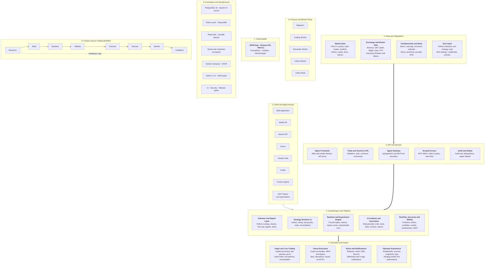
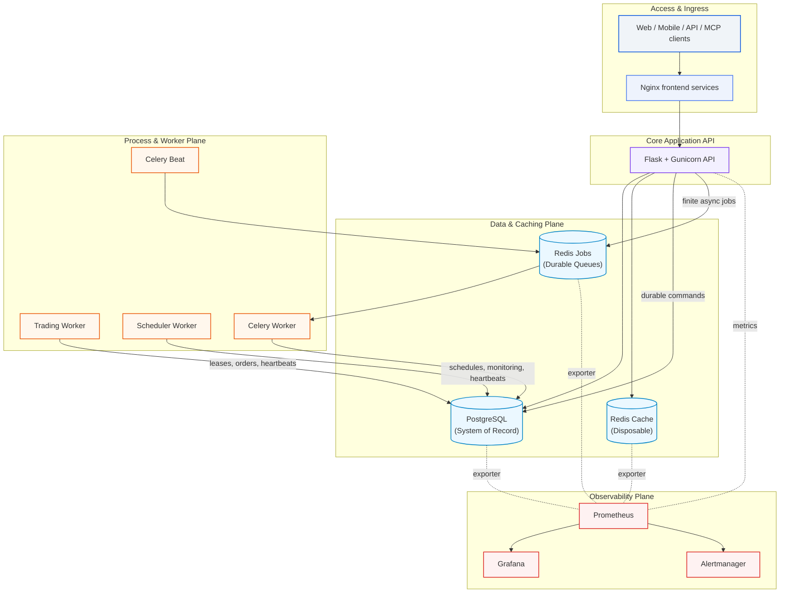

I ran the v5 diagrams against the actual repo before comparing — `OpenByteInc/QuantDinger` @ `e64e1c2` (main). Full write-up in `quantdinger-v5-comparison.md`. The short version: **you were right to push back — QuantDinger v5 is a bigger machine than my wave-1 snapshot gave it credit for, and on the operator-experience axes it beats us.** But the verification also nailed down where we are genuinely ahead, and it's not nothing.

## What the source verified (9 claims from your diagram)

| Claim | Verdict | Evidence |
|---|---|---|
| Agent Gateway `/api/agent/v1` + MCP boundary | ✅ | `agent_v1/__init__.py` mounts the blueprint; MCP server is explicitly "a thin wrapper" over it |
| Strategy Runtime v2 (intents/sizing/risk/state/reconciliation) | ✅ | `OrderIntentService` + `strategy_order_intents` table, `ProtectionSpec`, `StrategyV2LiveSession`, `alpaca_activity_reconciliation.py` |
| Worker plane (migration/trading/scheduler + Celery/Beat + PG leases) | ✅ | `migrate.py` fail-fast, `trading_worker.py` lease owner, `scheduler.py` PG leader election, `qd_worker_heartbeats` table |
| Paper→live with operator opt-in | ✅ | Dual gate: token `paper_only=false` **and** server env `AGENT_LIVE_TRADING_ENABLED` (no "promotion" term — it's a mode switch + kill switch) |
| Billing (credits/membership/USDT) | ✅ | `billing_service.py`, USDT payment watchers (evm/solana/tron) |
| Closed-loop workflow | ⚠️ partial | Docs show a **5-stage** loop; the 8-stage "Research→…→Feedback" phrasing exists only in the diagram caption |
| Multi-provider LLM | ✅ | 8 providers + LiteLLM path — a real abstraction |
| Backtest engine, pinned/reproducible | ✅ | `engineVersion` pin, `equityCurve` persisted to `qd_backtest_equity_points`, **OOS 70/30 split** |
| Statistical evidence gating | ⚠️ **advisory only** | `strategy_review.py`: `<5 trades` → "treat conclusions as directional"; no min-trade refusal, **no significance tests anywhere** |

## The deep dive, path by path

**The big architectural idea in your diagram is durable commands + leases.** Clients land on nginx → Flask → PG. The API writes *commands* into PostgreSQL (they survive restarts), workers *lease* them (`claim_next(owner_id, lease_seconds)`, heartbeats to `qd_worker_heartbeats`), Celery Beat drives async jobs from durable Redis. That's a serious distributed-execution design — a strategy runtime v2 (`StrategyV2LiveSession`) that runs statefully bar-by-bar, with intents carrying idempotency keys, sizing, `ProtectionSpec` guards, and *reconciliation* against the venue (activity + funding + ledger). Everything exports metrics to Prometheus → Grafana/Alertmanager, with request IDs through the stack.

Contrast with us: our gateway is **stateless and read-mostly** — the AI proposes, a human approves, the deterministic strategy in OpenAlgo does the executing. We don't need order-intent idempotency or venue reconciliation because we don't touch the venue (read:market, permanently). That is not a defect we should fix; it's the rung-3 boundary, deliberately.

## Comparison by axis

| Axis | QuantDinger v5 | Us | Who wins |
|---|---|---|---|
| Client surface | Web + mobile H5 + REST + MCP | MCP only (any client) | **Them** — we have no panel at all |
| UI panel | Dashboards, snapshots, strategy health | **None** — this is the gap you've been circling | **Them, clearly** |
| Data scope | 8 venues, stocks/crypto/fx/futures, fundamentals, news, sentiment | NSE options, one OpenAlgo desk, recorder captures | Different scope; both fit |
| Backtest engine | Version-pinned, equity curves, **OOS 70/30**, PIT data | Sim, replay tape, sweep jobs; **no OOS holdout** (it's on our roadmap) | **Them** |
| Evidence gating | Advisory `<5` trades diagnostic, no significance tests, no refusal | **Hard gate**: <30 trades → statistical claim refused; cited-mechanism alternative | **Us — and now source-verified, not asserted** |
| Risk | Live-order guards + paper default + kill switch env | Fail-closed caps, approval-only, kill switch, audit with off-box sink | Parity |
| Observability | Request IDs + Prometheus/Grafana/Alertmanager | `at doctor`, drift canary, audit sink; **no metrics stack, no request-ID correlation** | **Them** |
| Workers | PG-lease workers + Celery + durable Redis | Allowlist job queue (3 backends), in-process scheduler, canary cron | Parity, them finer-grained |
| Storage | PG system of record + Redis | Parquet+DuckDB warehouse + append-only files | Both deliberate |
| Multi-tenant/billing | Credits, membership, USDT | Single desk, by design | Out of our scope |

## The honest verdict

**Where they beat us (adopt these):**
1. **Out-of-sample holdout** — `_out_of_sample()` 70/30 split, point-in-time data only, confirm-on-close/fill-next-open. This is the one code gap on our own roadmap that they ship.
2. **Request-ID correlation + metrics/alerting** — we list "health alerting" as not-code-do-first; they ship Prometheus + Alertmanager out of the box.
3. **Backtest reproducibility pin** — `engineVersion` + `execution_count` on every result; ours stamps warehouse answers with build time but not backtest runs.
4. **The panel** — their operator UX (dashboards, snapshots, strategy health) is the exact FreqUI-style surface our synthesis already ranked as our #1 missing capability.

**Where we beat them (now verified, not claimed):** their evidence gate is a *diagnostic*, not a *gate* — a 10-trade backtest sails through with a "treat conclusions as directional" note. Ours refuses the claim entirely under 30 trades and demands a cited mechanism otherwise. That's the difference between an AI that can always suggest and an AI that cannot get anything through without measured proof. Jesse's <30 rule independently confirms our bar; QuantDinger's "10–20" recommendation is weaker than both.

---

##  QuantDinger v5 Architecture - For Understanding & Reference Only
QuantDinger Offical Repo: https://github.com/OpenByteInc/QuantDinger/

The diagram above shows the complete product and process architecture. The runtime topology below focuses on container-to-container ownership and data flow.

One backend image is reused by several containers with different commands:

| Process | Responsibility |
| --- | --- |
| `migration` | Applies the database schema and exits before application services start. |
| `backend` | Handles HTTP, authentication, validation, and durable command submission. |
| `trading-worker` | Owns strategy runtimes, pending orders, broker sessions, and reconciliation. |
| `scheduler-worker` | Runs portfolio, deployment, payment, and signal schedules. |
| `celery-worker` | Executes finite AI, backtest, experiment, report, and maintenance jobs. |
| `celery-beat` | Dispatches periodic Celery tasks. |

See [Backend process roles](https://github.com/OpenByteInc/QuantDinger/blob/main/docs/architecture/PROCESS_ROLES_AND_TASKS.md),
[architecture](https://github.com/OpenByteInc/QuantDinger/blob/main/docs/architecture/ARCHITECTURE.md), and
[concurrency model](https://github.com/OpenByteInc/QuantDinger/blob/main/docs/architecture/CONCURRENCY_MODEL.md) for the ownership rules.
