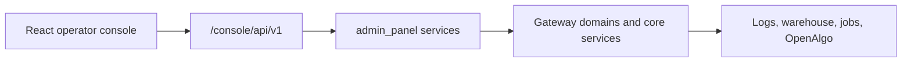

The panel is currently an excellent internal diagnostics page, but not yet an end-user operator product. Its core UX problem is that it leads with system implementation details—health rows, feature switches, and 214 raw settings—rather than the operator’s immediate question: “What needs my attention, and what can I safely do next?”

I inspected the live screens. The playbooks page repeats a catalogue table plus a form for each scope; Setup exposes every config group and raw environment key. That makes the UI read like documentation rendered as HTML.

## Product boundary

Treat this as an “operations console,” not a trading dashboard.

| This panel owns | OpenAlgo owns |
|---|---|
| Gateway health, data readiness, strategy lifecycle, analysis workflows, configuration, audit history | Orders, positions, broker account, live P&L, market data, money/risk decisions |

Keep the no-orders boundary absolute.

## Recommended information architecture

Replace the current three-item navigation with:

```text
Overview       Strategies       Investigate       Automations       Admin
```

- Overview — one-screen answer to “is the system ready?”
- Strategies — strategy-specific operational workspace
- Investigate — sessions, trade analysis, comparisons, playbooks
- Automations — scheduled jobs, runs, alerts, audit trail
- Admin — advanced configuration, credentials status, access, diagnostics

“Setup” should disappear as a top-level destination. It is an admin function, not the primary daily task.

## Home / Overview design

The first page should have only four sections:

1. Attention queue  
   “3 things need action”: recorder has no data, Telegram approver is unconfigured, last warehouse build is stale. Each item gets one plain-language action.

2. Operating status  
   Strategy running/stopped, last session, data freshness, scheduler, audit delivery. Use compact state cards—no raw paths or environment variables.

3. Today / latest session  
   Session date, trades, recorder coverage, notable failures, latest completed analysis. Show “No session data yet” as a clear empty state with setup action.

4. Safe next actions  
   “Connect data directory,” “Run data health check,” “Review latest session,” “Configure approval channel.” These should be guided flows, not documentation links.

## Strategies as the centre of the product

A strategy page should be the main workspace:

```text
BuyerEdgeStrategy
Status: Running | Last session: 06 Aug | Data: Current

Overview | Sessions | Analysis | Configuration | Activity
```

- Overview: health, version, last run, next scheduled run.
- Sessions: chronological list with status, trades, coverage and anomalies.
- Analysis: KPI trends, entry-gate findings, rejection analysis, version comparison.
- Configuration: only strategy-relevant settings; hide infrastructure and protocol mappings.
- Activity: lifecycle actions, config changes, playbook runs, audit events.

This object-first model is much easier than asking users to navigate by technical subsystem.

## Investigate and playbooks

Playbooks should become guided investigation flows, not static prompt templates.

Instead of four duplicated forms:

```text
What do you want to investigate?

[ A trade ] [ A session ] [ Recent sessions ] [ Strategy performance ]

Select scope → choose data → see available analyses → Run
```

After a run, show:

- What was examined
- Evidence and data coverage
- Findings
- Limits / missing data
- Suggested next action
- Save or export report

Use the existing Markdown playbooks as the back-end content source, but render them as workflow metadata. Do not show version hashes or filenames in the primary UI; place them under “Evidence and provenance.”

## Visual system

Keep the existing restrained dark style, but change the hierarchy:

- One clear primary action per page.
- Status colours only for state; retain the existing rule.
- Use cards for decisions and summaries; tables only for comparison/history.
- Put raw technical details in expandable “Advanced details.”
- Replace paragraphs at page bottoms with contextual help drawers.
- Use empty states with a next action, never a blank table.
- Add charts only where they answer a decision: session trend, coverage trend, version comparison. Avoid decorative dashboards.

## Correct stack

I would move from server-rendered HTML to a small typed web application, while preserving the current Python control plane.

```text
React + TypeScript + Vite
        ↓
TanStack Query + React Router
        ↓
FastMCP / Starlette gateway API
        ↓
Existing admin_panel service modules + gateway domains
```

Recommended pieces:

- Frontend: React, TypeScript, Vite, React Router.
- Data/API: TanStack Query; no Redux. Server data is the source of truth.
- UI: Tailwind CSS plus shadcn/ui primitives, with the current colour/state rules carried into design tokens.
- Forms: React Hook Form + Zod.
- Charts: Recharts for a small, controlled set of operational charts.
- Backend: retain FastMCP/Starlette and expose typed `/console/api/v1/*` endpoints using Pydantic models.
- Realtime: start with 30–60-second polling for status; add SSE only for live job progress or strategy state. Do not add WebSockets merely for a modern feel.

Do not introduce Next.js, a separate Node server, Redux, micro-frontends, or a database for UI state. This is a single-operator console; a Vite build served by the existing gateway is enough.

## Back-end architecture

Keep current data modules as the domain layer and replace only the presentation layer:



Add resources such as:

- `GET /console/api/v1/overview`
- `GET /console/api/v1/strategies`
- `GET /console/api/v1/strategies/{id}`
- `GET /console/api/v1/sessions`
- `POST /console/api/v1/investigations`
- `GET /console/api/v1/runs/{id}`
- `GET /console/api/v1/admin/settings`

Preserve the current CSRF, Origin/Referer, Host, proxy-auth, audit logging, and order-tool refusal rules for every mutation.

## Delivery order

1. Define the operator journeys and the five navigation areas.
2. Add typed APIs over existing `admin_panel` service functions.
3. Build the new shell and Overview first.
4. Build the Strategy workspace and session investigation flow.
5. Convert playbooks into guided investigations.
6. Move raw settings and diagnostics into Admin with search, grouping, confirmation, and restart impact.
7. Add charts and live refresh only after the workflows are clear.

The key change is conceptual: make the panel answer operational questions first, and reveal system detail only when the user asks for it.
